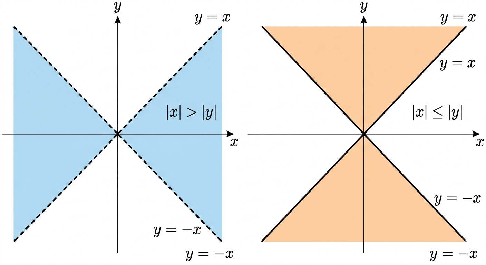

# 2026 S1

## AtCoder Beginner Contest [#447](https://atcoder.jp/contests/abc447)

E. Divide Graph

這題是練習題，基本上就是找將圖化為兩個連通塊的最小成本。

原本想先學一下 Tajan 演算法利用縮點將圖轉成一個樹，後來發現如果要將連通塊切開要使用其他演算法後就回來重新思考這題。

---

## AtCoder Beginner Contest [#448](https://atcoder.jp/contests/abc448)

D - Integer-duplicated Path

比賽的時候寫錯題沒寫到這題先寫 E，結果 E 卡到結束。這題就是簡單的 DFS

E - Simple Division

這題一開始聯想到快速冪，修改快速冪的寫法得到計算連續 k 個 digit 的方法

```cpp
ll MOD = 10007;
ll qappend(ll x, int n, ll mod) {
    ll res = 0;
    ll pow10 = 10;
    for (; n > 0; n /= 2) {
        if (n % 2) {
            res = (res * pow10 + x) % mod;
        }
        x = (x * pow10 + x) % mod;
        pow10 = pow10 * pow10 % mod;
    }
    return res;
}
```
但是最後在 $\frac{N}{M} \mod{P}$ 的時候卡住。

由 [ref](https://codeforces.com/blog/entry/48989) 得到 

$$N = (MP)Q + r$$

用 qappend 計算出 N ，計算過程的模數為 $M \times P$，最後兩邊同除 M 就是結果:

$$\frac{N}{M} = PQ + \frac{r}{M}$$

```cpp
for(int i = 0; i < K; ++i) {
    cin >> c >> l;
    N *= qpow(10, l, MOD * M);
    N += qcal(c, l, MOD * M);
    N %= (MOD * M);
}
cout<< (N / M) << endl;
```
## AtCoder Beginner Contest [#449](https://atcoder.jp/contests/abc449)

D - Make Target 2

這題一開始想用掃描線由 $[L, R]$ 計算每個位置可以有多少的合法點。但是一直卡在一些 edge case。
賽後發現錯誤是在 $[D, U]$ 都小於 0 的時候沒有把取絕對值後的 D 跟 U 做交換導致計算邏輯有問題。

基本的計算方式為 $cal(h, x)$ 為在 $[0, h]$ 區間且當前為 $x$ 有多少合法點。對於 $[D, U]$ 在 $x$ 有合法點:

$$cnt(U, x) - cnt(D - 1, x)$$


```cpp
void solve() {
    ll l, r, d, u;
    cin >> l >> r >> d >> u;
    ll ans = 0;
    auto cal = [&](ll h, ll x) -> ll {
        if(h == 0) return (x % 2 == 0);
        if(x >= h) return (x % 2 == 0) * (h + 1);
        ll res = 0;
        res += (x % 2 == 0) * (x + 1);
        res += (h - (x + 1) + (h % 2 == 0) + ((x + 1) % 2 == 0)) / 2;
        return res;
    };
    for(ll x = l; x <= r; ++x) {
        ll X = abs(x);
        ll lo = abs(d);
        ll hi = abs(u);
        /*********************/
        if(lo > hi) swap(lo, hi);
        /*********************/
        if(d * u < 0) {
            ans += cal(lo, X);
            ans += cal(hi, X);
            ans -= cal(0, X);
        } else if(d * u > 0) {
            ans += cal(hi, X) - cal(lo - 1, X);
        } else {
            if(lo) ans += cal(lo, X);
            if(hi) ans += cal(hi, X);
            if((lo == 0 && hi == 0)) ans += cal(0, X);
        }
    }
    cout<<ans<<endl;
}
```

* 官解
  
分別討論 $|x| > |y|$ 和 $|x| \le |y|$ 的情況:



由圖可以發現我們要找的點分別是這兩個區域內的頂點，因此分別使用兩條掃描線，掃過兩個區域就可以快速計算。

* $|x| > |y|$
  
圖中藍色區域，遍歷 $L \le x \le R$ 時，知道 $D \le y \le U$，因為 $|x| > |y|$ ，所以，$-|x| < y < |x|$，結合兩個不等式可以得到:

$$max(D, -|x| + 1) \le y \le min(U, |x| - 1)$$

```cpp
// |x| > |y|
for (int x = l; x <= r; x++) {
    if (x % 2 == 0) {
        int D = max(d, -abs(x) + 1);
        int U = min(u, abs(x) - 1);
        int C = U - D + 1;
        ans += max(C, 0);
    }
}
```

* $|x| \le |y|$

與上面同理，只不過差一個等號，因此不等式只會有一些改變:

$$max(L, -|x|) \le x \le min(R, |a|)$$

```cpp
// |x| <= |y|
for (int y = d; y <= u; y++) {
    if (y % 2 == 0) {
        int L = max(l, -abs(y));
        int R = min(r, abs(y));
        int C = R - L + 1;
        ans += max(C, 0);
    }
}
```