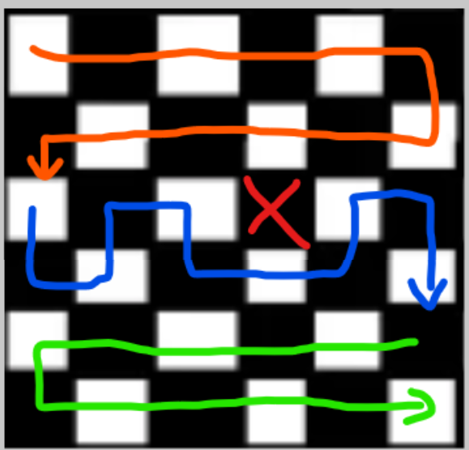

# 20226 S2


## AtCoder Beginner Contest [#453](https://atcoder.jp/contests/abc453)

D - Go Straight

單純的 BFS，但是比賽的時候一直 MLE。宣告了兩個 $5 \times 10^6$ 的陣列使用，結果賽後改成一個就過了。

* Atcoder 的空間宣告上限大概是 $10^7$

E - Team Division

這題只有想到枚舉其中一隊的人數 k 分到另一隊的人數為 n - k，然後就不知道該怎麼處理滿足 n - k 時的限制。

這題是技巧性很強的題目。

1. 首先第一個套路是枚舉某一隊分到的人數 $k = 1, 2, ... , n - 1$ 則另一隊人數則是 $n - k = n - 1, n - 2, ... , 1$。
2. 接著分類討論 A 隊有 k 個人的分隊情況，對於每個人的限制會有:
    1. 能分到 A
        此時 $L_i \le k \le R_i$
    2. 能分到 B
        此時 $L_i \le n - k \le R_i$，轉換後為 $n - R_i \le k \le n - L_i$
    3. A, B 都能滿足
        由上面可以知道範圍為 $max(L_i, n - R_i) \le k \le min(R_i, n - L_i)$
    4. A, B 都不能滿足
        這個情況會導致有人無法分到 A, B 其中一隊因此這種情況不去計算
   
3. 當 A 隊分到 k 個人時，可以知道一定要被分到 A 隊的人有 $C_a - C_c$，$C_a$ 表示能分到 A 的有幾個人，$C_c$ 表示能同時分到 A 和 B 的有幾個人。因此 A 隊還需要從 $C_c$ 中挑選 $k - (C_a - C_c)$，此時方案數會是 $\binom{C_c}{k - (C_a - C_c)}$
   
4. 利用前綴和 + 差分計算 k 個人時不同的分隊情況

* 要注意 "A, B 都不能滿足＂的情況可以利用 $C_a + C_b - C_c < n$ 判斷。

```cpp
void solve() {
    int n, la, ra;
    cin >> n;

    vector<ll> Ca(n + 2), Cb(n + 2), Cc(n + 2);
    auto add = [](vector<ll> &v, int l, int r) -> void {
        if(l > r) return;
        v[l]++; v[r + 1]--;
    };
    for(int i = 0; i < n; ++i) {
        cin >> la >> ra;
        add(Ca, la, ra);
        add(Cb, n - ra, n - la);
        add(Cc, max(la, n - ra), min(ra, n - la));
    }
    for(int k = 1; k <= n - 1; k++) {
        Ca[k] += Ca[k - 1];
        Cb[k] += Cb[k - 1];
        Cc[k] += Cc[k - 1];
    }
    ll ans = 0;
    for(int k = 1; k <= n - 1; ++k) {
        if(Cb[k] + Ca[k] - Cc[k] != n) continue;
        int onlyA = Ca[k] - Cc[k];
        int need = k - onlyA;
        ans += comb(Cc[k], need);
        ans %= MOD;
    }
    cout<<ans<<endl;
}
```

---
## AtCoder Beginner Contest [#454](https://atcoder.jp/contests/abc454)

E - LRUD Moving

透過黑白染色，可以發現若是在網格圖上的路徑一定會是黑白/奇偶交錯: $W \rightarrow B \rightarrow W ....$

由這個小結論可以發現白色的個數會比黑色多一個，因此可以知道:

1. $N$ 為奇數一定無解
2. (A, B) 若是在白色也會無解

```
for 4 x 4
O X O X
X O X O
O X O X
```

接著可以透過這樣的路徑構造答案



利用三種路徑構造出答案

F - Make it Palindrome 2

---
## AtCoder Beginner Contest [#455](https://atcoder.jp/contests/abc455)

E - Unbalanced ABC Substrings

這題幾乎跟 [leetcode weekly #471-Q3](https://slipet.github.io/5lipet/contest/leetcode/2025_S4/#weekly-contest-471) 一模一樣只不過把計算長度改成計算次數，但是因為沒思考清楚導致沒寫出來。

這題主要就是計算:

$$\frac{n(n + 1)}{2} - f(A, B) - f(B, C) - f(A, C) + 3f(A,B,C) - f(A,B,C)$$

$f(A,B)$ 表示出現次數 A = B 的子字串個數。


但是我在範例 $AABBC_0C_1$， 計算 $f(A, B)$ 的時候一直沒算到只有 C 的情況，也就是 $C_0, C_0C_1, C_1$ 這種情況。

```cpp
void solve() {
    ll n;
    cin >> n;
    string s;
    cin >> s;
    ll ans = n * (n + 1) / 2;
    
    auto cal = [&](vector<char> ch) -> void {
        ll cnt = 0;
        htb(int, int) pre;
        int sum = 0;
        pre[0] = 1;
        for(int i = 0; i < n; ++i) {
            if(s[i] == ch[0]) sum++;
            else if(s[i] == ch[1]) sum--;
            cnt += pre[sum];
            pre[sum]++;
        }
        ans -= cnt;
    };
    auto cal2 = [&]() -> void {
        ll cnt = 0;
        htb(pii, int) pre;
        ll sum[2]{};
        pre[make_pair(0, 0)] = 1;
        for(int i = 0; i < n; ++i) {
            int c = s[i] - 'A';
            if(c == 0) {
                sum[0]++;
            } else if(c == 1) {
                sum[0]--;
                sum[1]++;
            } else {
                sum[1]--;
            }
            cnt += pre[make_pair(sum[0], sum[1])];
            pre[make_pair(sum[0], sum[1])]++;
        }
        ans += 2LL * cnt;
    };
    cal({'A', 'B'});
    cal({'A', 'C'});
    cal({'B', 'C'});
    cal2();
    cout<<ans<<endl;
}
```

---

## AtCoder Beginner Contest [#456](https://atcoder.jp/contests/abc455)

E - Endless Holidays

前四題秒殺，結果在這題坐牢一個半小時。

觀察到要最終是要找圖上的環，但是用 DFS 一直調不對。

* 對於找環的題目用拓樸排序還是更無腦一點，不需要維護當前路徑上的點。

```cpp
void solve() {
    int n, m, u, v, w;
    cin >> n >> m;
    string s;
    
    vector<pii> edges;
    vector<int> weeks(n);
    for(int i = 0; i < m; ++i) {
        cin >> u >> v;
        u--; v--;
        edges.emplace_back(u, v);
        edges.emplace_back(v, u);
    }
    cin >> w;
    for(int i = 0; i < n; ++i) {
        cin >> s;
        for(int j = 0; j < w; ++j) {
            if(s[j] =='o') {
                weeks[i] |= 1 << j;
            }
        }
    }
    for(int i = 0; i < n; ++i) edges.emplace_back(i, i);
    vector<vector<int>> g(n * w);
    vector<int> deg(n * w);
    for(auto &[from, to]: edges) {
        for(int d = 0; d < w; ++d) {
            int nxtd = (d + 1) % w;
            if((weeks[from] >> d & 1) && (weeks[to] >> nxtd & 1)) {
                g[encode(from, d, w)].pb(encode(to, nxtd, w));
                deg[encode(to, nxtd, w)]++;
            }
        }
    }
    queue<int> q;
    int cnt = 0;
    for(int i = 0; i < n * w; ++i) {
        if(deg[i] == 0) q.push(i);
    }
    while(!q.empty()) {
        int u = q.front();
        q.pop();
        cnt++;
        for(auto &v: g[u]) {
            deg[v]--;
            if(deg[v] == 0) {
                q.push(v);
            }
        }
    }
    if(cnt < n * w) {
        cout<<"Yes"<<endl;
    } else {
        cout<<"No"<<endl;
    }
}
```

F - Plan Holidays

這題我首先想到的是使用區間 DP 的做法 $f(i, k) = min(f(i - 1, k - 1) + a_i, f(i - 3, k - 3) + a_{i - 2} + a_{i})$ ，$f(i, k)$ 是以 $i$ 結尾連續 k 個元素的最小花費，但是這個做法會需要 $O(nk)$ 的時間複雜度。

考慮另一種轉移方式，先不考慮連續 k 的限制，把題目看成構造連續元素最少需要多少花費。使用狀態機 DP 增加一個參數表示選或不選:

\[
\begin{array}{ll}
    f(i, 0) = f(i - 1, 1)\\
    f(i, 1) = min(f(i - 1, 0), f(i - 1, 1)) + a_i
\end{array}
\]

$f(i, 0)/f(i, 1)$ 表示以 $i$ 為結尾時選或不選元素 $i$ 時連續元素最少花費。對於上面的式子發現所有的 $i \in [1, n]$ 都使用同樣的轉移方程。因此對於這種轉移方程可以透過矩陣來優化，將普通矩陣乘法運算，矩陣 $A_{i, k}$ 和 $B_{k, j}$ 相乘: 

$$A_{i, k} \times B_{k, j} = \sum_i \sum_j M[i][j] = \sum_i \sum_j \sum_k A[i][k] + B[k][j]$$ 

改成:

$A_{i, k} \otimes B_{k, j} = \sum_i \sum_j M[i][j] = \sum_i \sum_j \min_k A[i][k] + B[k][j]$

所以式子寫成:

$$
\begin{bmatrix}
f(i, 0) \\
f(i, 1)
\end{bmatrix}
= \
\begin{bmatrix}
\infty & 0\\
a_i & a_i
\end{bmatrix}
\begin{bmatrix}
f(i - 1, 0) \\
f(i - 1, 1)
\end{bmatrix}
= \
\begin{bmatrix}
f(i - 1, 1) \\
min(f(i - 1, 0) + a_i, f(i - 1, 1) + a_i)
\end{bmatrix}
$$

設矩陣 $A_i = \begin{bmatrix}
\infty & 0\\
a_i & a_i
\end{bmatrix}$ ，因此若是要知道區間 $[l, r]$ 的結果，可以寫成:

$$
\begin{bmatrix}
f(i, 0) \\
f(i, 1)
\end{bmatrix}
= \
A_{r} \otimes A_{r - 1} \otimes ... \otimes A_l \otimes
\begin{bmatrix}
f(-1, 0) \\
f(-1, 1)
\end{bmatrix}
$$

設 $f(-1, 0)/f(-1, 1)$ 為初始值 $\begin{bmatrix}
f(-1, 0) \\
f(-1, 1)
\end{bmatrix} = \begin{bmatrix}
0 \\
\infty
\end{bmatrix}$。

對於 $A_{r} \otimes A_{r - 1} \otimes ... \otimes A_l$ 的計算可以利用線段樹進行維護，在 $O(\log{n})$ 的時間求出。

* 使用線段樹計算要注意，一般來說線段樹在合併的時候都是 "左 + 右"，但是對於矩陣運算左右的順序要仔細思考，順序要交換改成 "右" $\otimes$ "左"，才會符合上面的定義。

* **zkw 矩陣運算**

```cpp
#define lc(x) (x << 1)
#define rc(x) (x << 1 | 1)

template<typename T, int R, int C>
struct Matrix {
    array<array<T, C>, R> a;
    Matrix(T init_val = T{}) {
        for(auto &row: a) {
            ranges::fill(row, init_val);
        }
    }
    array<T, C> & operator[](int i) {
        return a[i];
    }
    const array<T, C> &operator[](int i) const {
        return a[i];
    }

    template <int K>
    Matrix<T, R, K> operator *(const Matrix<T, C, K> &b) const {
        Matrix res(T{infll});
        for(int i = 0; i < R; ++i) {
            for(int k = 0; k < C; ++k) {
                for(int j = 0; j < K; ++j) {
                    chmin(res[i][j], a[i][k] + b[k][j]);
                }
            }
        }
        return res;
    };
};
using Mat_t = Matrix<ll, 2, 2>;
const int MAXN = 2'000'00 + 5;
Mat_t tree[MAXN << 2];
ll a[MAXN];
int base;

Mat_t merge(Mat_t &a, Mat_t &b) {
    return a * b;
}

void build(int n) {
    for(base = 1; base <= n + 2; base <<= 1);
    for(int i = 1; i <= n; ++i) {
        cin >> a[i];
        auto &mat = tree[base + i].a;
        mat[0][0] = infll;
        mat[0][1] = 0;
        mat[1][0] = mat[1][1] = a[i];
    }
    for(int i = base - 1; i; --i) {
        tree[i] = merge(tree[lc(i)], tree[rc(i)]);
    }
}

Mat_t query(int ql, int qr) {
    Mat_t rsL(0), rsR(0);
    rsL.a[0][1] = rsL.a[1][0] = rsR.a[0][1] = rsR.a[1][0] = infll;
    for(ql += base - 1, qr += base + 1; ql ^ qr ^ 1; ql >>= 1, qr >>= 1) {
        if(~ql & 1) rsL = merge(rsL, tree[ql ^ 1]);
        if(qr & 1) rsR = merge(tree[qr ^ 1], rsR);
    }
    return merge(rsL, rsR);
}

void solve() {
    int n, k;
    cin >> n >> k;
    build(n);
    ll ans = infll;
    a[0] = infll;
    for(int l = 1; l + k - 1 <= n; ++l) {
        auto res = query(l, l + k - 1);
        chmin(ans, res[1][0]);
        chmin(ans, res[0][1] + a[l - 1]);
        chmin(ans, res[1][1] + a[l - 1]);
    }
    cout<<ans<<endl;
}
```

??? note "遞迴式"

    ```cpp
    template <typename T>
    struct Matrix {
        int m, n;
        vector<vector<T>> a;
        Matrix() : m(0), n(0) {}
        Matrix(int m, int n, T init_val): n(n), m(m), a(m, vector<T>(n, init_val)) {}

        vector<T>& operator[](int i) {
            return a[i];
        }

        const vector<T>& operator[](int i) const {
            return a[i];
        }

        Matrix operator *(const Matrix &b) const {
            Matrix<T> res(m, b.n, infll);
            for(int i = 0; i < m; ++i) {
                for(int j = 0; j < b.n; ++j) {
                    for(int k = 0; k < n; ++k) {
                        res[i][j] = min(res[i][j], a[i][k] + b[k][j]);
                    }
                }
            }
            return res;
        };
    };

    template<typename T>
    class SegmentTree {
        int n;
        vector<T> tree;

        T merge_val(T &a, T &b) const {
            return a * b; // **根据题目修改**
        }

        void maintain(int node) {
            tree[node] =  tree[node * 2 + 1] * tree[node * 2];
        }

        void build(const vector<T>& a, int node, int l, int r) {
            if (l == r) { // 叶子
                tree[node] = a[l]; // 初始化叶节点的值
                return;
            }
            int m = (l + r) / 2;
            build(a, node * 2 + 1, m + 1, r); // 初始化右子树
            build(a, node * 2, l, m); // 初始化左子树
            maintain(node);
        }
        void update(int node, int l, int r, int i, T &val) {
            if (l == r) { // 叶子（到达目标）
                tree[node] = val;
                return;
            }
            int m = (l + r) / 2;
            if (i <= m) { // i 在左子树
                update(node * 2, l, m, i, val);
            } else { // i 在右子树
                update(node * 2 + 1, m + 1, r, i, val);
            }
            maintain(node);
        }
        T query(int node, int l, int r, int ql, int qr) const {
            if (ql <= l && r <= qr) { // 当前子树完全在 [ql, qr] 内
                return tree[node];
            }
            int m = (l + r) / 2;
            if (qr <= m) { // [ql, qr] 在左子树 -> ql, qr, m
                return query(node * 2, l, m, ql, qr);
            }
            if (ql > m) { // [ql, qr] 在右子树 -> m + 1, ql, qr
                return query(node * 2 + 1, m + 1, r, ql, qr);
            }
            T r_res = query(node * 2 + 1, m + 1, r, ql, qr);
            T l_res = query(node * 2, l, m, ql, qr);
            
            return merge_val(r_res, l_res);
        }

    public:
        SegmentTree(int n, T init_val) : SegmentTree(vector<T>(n, init_val)) {}

        SegmentTree(const vector<T>& a) : n(a.size()), tree(2 << bit_width(a.size() - 1)) {
            build(a, 1, 0, n - 1);
        }

        void update(int i, T &val) {
            update(1, 0, n - 1, i, val);
        }

        T query(int ql, int qr) const {
            return query(1, 0, n - 1, ql, qr);
        }

    };
    const int MAXN = 2e5 + 5;
    SegmentTree<Matrix<ll>> t(MAXN, Matrix<ll>(2, 2, 0));

    void solve() {
        int n, k, x;
        cin >> n >> k;
        Matrix<ll> a(2, 2, 0);
        for(int i = 0; i < n; ++i) {
            cin >> x;
            a[0][0] = infll; a[0][1] = 0;
            a[1][1] = a[1][0] = x;
            t.update(i, a);
        }
        ll ans = infll;
        Matrix<ll> init(2, 1, 0);
        init[1][0] = infll;
        for(int i = k - 1; i < n; ++i) {
            auto res = t.query(i - k + 1, i);
            res = res * init;
            chmin(ans, res[1][0]);
            if(i - k >= 0) {
                res = t.query(i - k, i);
                res = res * init;
                chmin(ans, res[1][0]);
            }
        }
        cout<<ans<<endl;
    }
    ```


??? note "常數比較小的實現"

    ```cpp
    template <typename T, int R, int C>
    struct Matrix {
        array<array<T, C>, R> a;
        
        Matrix(T init_val = T{}) {
            for(auto &row: a) {
                ranges::fill(row, init_val);
            }
        }

        array<T, C>& operator[](int i) {
            return a[i];
        }

        const array<T, C>& operator[](int i) const {
            return a[i];
        }
        template <int K>
        Matrix<T, R, K> operator *(const Matrix<T, C, K> &b) const {
            Matrix res(T{infll});
            for(int i = 0; i < R; ++i) {
                for(int k = 0; k < C; ++k) {
                    for(int j = 0; j < K; ++j) {
                        chmin(res[i][j], a[i][k] + b[k][j]);
                    }
                }
            }
            return res;
        };

    };


    #define lc ((node) << 1)
    #define rc ((node) << 1 | 1)

    using Mat_t = Matrix<ll, 2, 2>;
    const int MAXN = 2'000'00 + 5;
    Mat_t tree[MAXN << 2];
    ll a[MAXN];

    void build(int node, int l, int r) {
        if(l == r) {
            tree[node][0][0] = infll;
            tree[node][0][1] = 0;
            tree[node][1][0] = tree[node][1][1] = a[l];
            return;
        }
        int m = l + (r - l) / 2;
        build(rc, m + 1, r);
        build(lc, l, m);
        tree[node] = tree[rc] * tree[lc];
    }
    Mat_t query(int node, int l, int r, int ql, int qr) {
        if(ql <= l && r <= qr) {
            return tree[node];
        }
        int m = l + (r - l) / 2;
        if(qr <= m) return query(lc, l, m, ql, qr);
        else if(ql > m) return query(rc, m + 1, r, ql, qr);
        else return query(rc, m + 1, r, ql, qr) * query(lc, l, m, ql, qr);
    }

    void solve() {
        int n, k, x;
        cin >> n >> k;
        for(int i = 1; i <= n; ++i) cin >> a[i];
        build(1, 1, n);
        ll ans = infll;
        a[0] = infll;
        for(int l = 1; l + k - 1 <= n; ++l) {
            auto res = query(1, 1, n, l, l + k - 1);
            chmin(ans, res[1][0]);
            chmin(ans, res[0][1] + a[l - 1]);
            chmin(ans, res[1][1] + a[l - 1]);
        }
        cout<<ans<<endl;
    }
    ```

## AtCoder Beginner Contest [#457](https://atcoder.jp/contests/abc457)

D -	Raise Minimum

這題因為大數運算的關係導致 WA 和 RE 錯了 10 次。

發生的錯誤有

1. ceil 計算少 -1(主要的問題)
2. 對於 cnt 沒有用大數導致出錯
3. WA 太多次導致後來寫一個多餘的判斷

```cpp
void solve() {
    ll n, k;
    cin >> n >> k;
    vector<ll> a(n), idx(n);
    readv(n, a[i]);
    ranges::iota(idx, 0);
    ranges::sort(idx, {}, [&](const auto &i) { return a[i]; });
    ll l = 0, r = infll;
    auto check = [&](ll limit) -> ll {
        __int128 cnt = 0;
        for(auto &i: idx) {
            ll x = a[i];
            ll inc = i + 1;
            if(x > limit) break;
            cnt += (limit - x + inc - 1) / inc;
        }
        return ll(cnt <= (__int128)k);
    };
    while(l + 1 < r) {
        ll m = l + (r - l) / 2;
        (check(m) ? l : r) = m;
    }
    cout<<l<<endl;
}
```

E -	Crossing Table Cloth 

這題是給了一堆區間 $[l, r]$，然後回答詢問 $q$ 區間 $[q_l, q_r]$ 能否恰好被兩個區間覆蓋。這題主要考察分類討論的能力。

1. 首先想到對於 $[l = q_l, r = q_r]$:

    1. 有兩個以上 $[l, r]$ 的區間 $\rightarrow$ 直接滿足要求
    2. 只有一個 $[l, r]$ 的區間 $\rightarrow$ 需要找到一個區間符合 $[ql <= l, r <= qr]$ 。
    
        這是一個二維偏序問題，可以先將詢問的右端點排序按照順序加入左端點，用值域 BIT 回答詢問。

        使用後綴陣列表示 $<= L$ 的最靠近右端點 $R$，如下面實作。


2. 觀察到道題目要求的是恰好覆蓋，因此若是沒有 $[q_l = l, r = q_r]$ 的區間，那我們必須要分別在 $[q_l = l, r < qr], [q_l < l, r = qr]$ 各自找到一個區間。

    先透過左右端點分組，然後用二分找答案

```cpp
void solve() {
    int n, m, S, T, L, R;
    cin >> n >> m;
    vector<vector<int>> left(n + 1), right(n + 1);
    vector<int> mn(n + 2, inf);
    map<pii, int> dict;
    for(int i = 0; i < m; ++i) {
        cin >> L >> R;
        dict[make_pair(L, R)]++;
        left[L].pb(R);
        right[R].pb(L);
        chmin(mn[L], R);
    }
    for(int i = 1; i <= n; ++i) {
        ranges::sort(left[i]);
        ranges::sort(right[i]);
    }
    vector<int> suf_r(n + 2, inf);
    for(int i = n; i >= 1; i--) {
        suf_r[i] = min(suf_r[i + 1], mn[i]);
    }
    int q;
    cin >> q;
    
    for(int i = 0; i < q; ++i) {
        cin >> S >> T;
        int valid = false;
        auto it = dict.find(make_pair(S, T));
        if(it != dict.end()) {
            int cnt = it->second;
            valid |= cnt >= 2;
            valid |= suf_r[S + 1] <= T;
            valid |= suf_r[S] <= T - 1;
            cout<<(valid? "Yes" : "No") <<endl;
            continue;
        }
        valid = false;
        auto &lpos = left[S];
        auto &rpos = right[T];
        
        int r = ranges::upper_bound(lpos, T) - lpos.begin() - 1;
        int l = ranges::upper_bound(rpos, S) - rpos.begin();
        
        if(r >= 0 && l < rpos.size()) {
            valid |= lpos[r] + 1 >= rpos[l];
        }
        cout<<(valid? "Yes" : "No") <<endl;
    }

}
```

## AtCoder Beginner Contest [#458](https://atcoder.jp/contests/abc458)

E - Count 123

這題是要算長度為 $n = x_1 + x_2 + x_3$ 的序列方案數，同時序列中相鄰元素差距小於1，此時可以發現我們的目標會是序列當中 $x_1$ 和 $x_3$ 不相鄰的方案數。中間有想過用全部減去 $x_1$ 和 $x_3$ 相鄰的方案數，但是情況太多沒想出來。

寫的過程中有一個很接近的想法是先把 $x_2$ 確定 $\binom{n}{x_2}$ 然後用 $x_2$ 當作隔板插入 $x_1$ 此時方案數為 $\binom{n}{x_2}\binom{n - x_2}{x_1}$，結果因為不知道如何處理 $x_3$ 就沒想出來。

中間有意識到要把 $x_2$ 當作隔板，插入 $x_1$ 中然後枚舉分成 k 個 $x_1$ 的區塊，此時會是 $\binom{x_1 - 1}{k - 1}$，對於 $x_2$ 則是要在 $x_2 + 1$ 個空間(看成盒子)中 選擇 k 個位置放 $x_1$，此時會是 $\binom{x_2 + 1}{k}$，接著我就沒想法了。

最後應該是在剩下的空格中 $x_2 + 1 - k$ 放入 $x_3$，由 [link]() 可以知道這相當於把 m 個無差別的小球放入 n 個有區別的盒子，且允許空盒的方案數，為$\binom{m + n - 1}{n - 1}$ 代回上面 $\binom{x_3 + (x_2 + 1 - k) - 1}{(x_2 + 1 - k) - 1} = \binom{x_3 + x_2 - k}{x_2 - k}$

```cpp
void solve() {
    ll a, b, c;//1, 2 3
    cin >> a >> b >> c;
    ll ans = 0;
    for(int k = 1; k <= b; ++k) {
        ans = (ans + comb(b + 1, k) * comb(a - 1, k - 1) % MOD * comb(b + c - k, b - k)) % MOD;
    }
    cout<<ans<<endl;
}
```

F - Critical Misread

這題看這個講解很清楚，這題的核心就是在 Trie 上走 n 步的方案數。

[講解](https://zhuanlan.zhihu.com/p/2039100846475048096)

這題要注意的是對於每個字串的結尾是不能抵達的狀態，此時除了由父節點轉移過來，還有可能從 fail 指過來，因此要另外處理這種情況。

最後 DP 矩陣的定義為 $M_{u,v}^1$ 表示由狀態 $u$ 走一步到 $v$ 的方案數，透過矩陣快速冪可以得到 $M_{u,v}^n$，表示由 u 走 n 步到 v 的方案數，因此最後的答案是 $\sum_{v}{M_{root, v}^n}$

```cpp
const ll mod = 998244353;
template<typename T>
struct Matrix {
    int m, n;
    vector<vector<T>> a;
    Matrix(): m(0), n(0) {}
    Matrix(int m, int n, T init_val = T{}): m(m), n(n), a(m, vector<T>(n, init_val)) {}
    
    vector<T>& operator[](int i) {
        return a[i];
    }
    const vector<T>& operator[](int i) const {
        return a[i];
    }
    static Matrix identity(int n) {
        Matrix<T> I(n, n, T{});
        for(int i = 0; i < n; ++i) I[i][i] = 1;
        return I;
    }
    Matrix operator*(const Matrix &b) const {
        Matrix res(m, b.n, T{});
        for(int i = 0; i < m; ++i) {
            for(int k = 0; k < n; ++k) {
                for(int j = 0; j < b.n; ++j) {
                    res[i][j] += a[i][k] * b[k][j];
                    res[i][j] %= mod;
                }
            }
        }
        return res;
    };
};

const int MAXN = 1000; 

struct Node {
    int ch[26];
    int fail;
    int end;
} trie[MAXN + 5];

int dummy = 0;
int root = 1;
int cnt = 1;

void insert(string &s) {
    int cur = root;
    for(auto &c: s) {
        if(!trie[cur].ch[c - 'a']) trie[cur].ch[c - 'a'] = ++cnt;
        cur = trie[cur].ch[c - 'a'];
    }
    trie[cur].end = 1;
}

void build() {
    queue<int> q;
    for(int i = 0; i < 26; ++i) trie[dummy].ch[i] = root;
    trie[root].fail = dummy;
    q.push(root);
    while(!q.empty()) {
        int cur = q.front();
        q.pop();
        trie[cur].end |= trie[trie[cur].fail].end;
        for(int i = 0; i < 26; ++i) {
            if(!trie[cur].ch[i]) {
                trie[cur].ch[i] = trie[trie[cur].fail].ch[i];
                continue;
            }
            trie[trie[cur].ch[i]].fail = trie[trie[cur].fail].ch[i];
            q.push(trie[cur].ch[i]);
        }
    }
}

Matrix<ll> qpow(auto &x, int n) {
    auto res = Matrix<ll>::identity(x.m);
    while(n) {
        if(n & 1) res = res * x;
        x = (x * x);
        n >>= 1;
    }
    return res;
}

void solve() {
    ll n, k;
    cin >> n >> k;
    string s;
    for(int i = 0; i < k; ++i) {
        cin >> s;
        insert(s);
    }
    build();
    int sz = cnt + 1;
    Matrix<ll> M(sz, sz, 0LL);
    for(int u = root; u < sz; ++u) {
        for(int i = 0; i < 26; ++i) {
            int v = trie[u].ch[i];
            if(trie[u].end || trie[v].end) continue;
            M[u][v]++;
        }
    }
    M = qpow(M, n);
    ll ans = 0;
    for(int u = root; u < sz; ++u) {
        if(!trie[u].end) ans = (ans + M[root][u]) % mod;
    }
    cout<<ans<<endl;
}
```

## AtCoder Beginner Contest [#459](https://atcoder.jp/contests/abc459)

C - Drop Blocks

這題有兩種操作

1. 把 cell i 加上 1，若全部 cell 都 $\ge 1$ 觸發全體減 1 的操作。
2. 回答 $\ge x$ 的 cell 個數

我的作法是透過值域 BIT 維護 cell 的值域，如果 $\ge 0$ 的個數超過 $n$ 就把 offset 向右移一位。每次只操作 $[offset, \infty]$ 間的個數。

可以發現 cell i 的值只會不斷增加，因此可以利用這個特性做出一些特殊操作:

1. 紀錄 $cnt[offset]$ 表示有多少 cell i 還是 offset 的值，若是 $cnt[offset]$ 只剩下 0 那就表示所有 cell i 都至少 $offset + 1$ 所以要把 offset 向右移一位。
2. 記錄某個值被 cell 經過的次數，每次回答 $vis[x + offset]$ ，因為 cell i 的值只會不斷增加，且因為整數的連續性所以透過記錄經過某個值的次數可以知道 $\ge x$ 有多少個。由下面可以看到 cell 2 的值會從 $0 \rightarrow 1 \rightarrow 2$

```
cell| 0|1 |2 |3 |
====================
0   |--|--|--|--|
1   |--|
2   |--|--|--|
```

* 這題要注意 $x + offset$ 有可能會**越界**所以要馬特判，要馬初始化陣列開大一點。

```cpp
constexpr int MXN = 6e+5;
int a[MXN+1]={};
int cnt[MXN+1]={};
int vis[MXN+1]={};

void solve() {

    int n, q, type, x;
    cin >> n >> q;
    cnt[0] = vis[0] = n;
    int offset = 0;
    for(int i = 0; i < q; ++i) {
        cin >> type >> x;
        if(type == 1) {
            int v = a[x];
            cnt[v]--;
            a[x] = v + 1;
            cnt[v + 1]++;
            vis[v + 1]++;
            while (offset <= MXN && cnt[offset] == 0) offset++;
            assert(offset <= MXN);

        } else {
            int cur = x + offset;
            assert(0 <= cur && cur <= MXN);
            cout<<vis[cur]<<endl;
        }
    }
}
```

E - Select from Subtrees

這題錯的地方有兩個:

1. 沒用模反算組合數的除法
2. 每個計算都要模

F - -1, +1

我一開始觀察到可以透過一系列的操作使得 **$A_i$ 減一 $A_{i+1}$ 加一**可以鏈式傳遞，因此我們要

```cpp
void solve() {
    ll n;
    cin >> n;
    ll ans = 0;
    vector<ll> a(n + 1);
    readv(n, a[i + 1]);
    stack<pll> st;
    int lst = -(int)1e7;
    for(int i  = 1; i <= n; ++i) {
        int cur = a[i];
        if(cur > lst) {
            if(cur - (lst + 1)) st.emplace(i, cur - (lst + 1));
        } else {
            while(!st.empty()) {
                auto [j, left] = st.top();
                st.pop();
                if(cur + left * (i - j) > lst - left) {
                    ll k = (lst + 1 - cur) / (i - j + 1);
                    lst -= k;
                    cur += (i - j) * k;
                    ans += (i - j + 1) * (i - j) / 2 * k;
                    
                    if(cur > lst) {
                        if(left - k) st.emplace(j, left - k);
                    } else {
                        if (left - k - 1) st.emplace(j, left - k - 1);
                        int nj = j + lst + 1 - cur;
                        cur += nj - j;
                        ans += (i - j + i - (nj - 1)) * (nj - j) / 2;
                        if (nj == i) {
                            lst--;
                            st.push({nj, cur - lst - 1});
                        } else {
                            st.push({nj, 1});
                        }
                    }
                    break;
                } else {
                    cur += (i - j) * left;
                    lst -= left;
                    ans += (i - j) * (i - j + 1) / 2 * left; 
                }
            }
        }
        lst = cur;
    }
    cout<<ans<<endl;
}
```

[影片](https://www.bilibili.com/video/BV1MqGH6rE4Z/?share_source=copy_web&vd_source=254c58ca4eebbc39db4ba1df067fb4ad)
[講解](https://zhuanlan.zhihu.com/p/2041652292030576057)


## AtCoder Beginner Contest [#460](https://atcoder.jp/contests/abc460)

E - x + y ≡ x + y

比賽想到:

$$concat(x, y) = x \times 10^{L(y)} + y \equiv x + y \mod{M}$$

移項可以得到

$$x \times (10^{L(y)} - 1) \equiv 0 \mod{M}$$

接著我我就卡了整場比賽。我只觀察到 y 是可以不用管的部分，但是沒意識到 y 的位數會影響 $L(y)$。

透過枚舉 y 的位數可以知道 $y \in [10^{d-1}, 10^d - 1]$，設這樣 y 有 ${cnt}_y$。

而 $M \mid x \times (10^{L(y)} - 1)$ 的個數透過數論的小結論可以得到:

$$\frac{M}{g_y} \mid x \text{ , } g_y = \gcd(M, 10^{L(y)} - 1)$$

因此我們要求的個數為 ${cnt}_y \times \lfloor \frac{n}{M/g_y} \rfloor$

## AtCoder Beginner Contest [#461](https://atcoder.jp/contests/abc461)

D - Count Subgrid Sum = K

一開始以為是二維前綴和，但是看到複雜度 $O(n^3)$ 後就卡住了，賽後發現複雜度如果仔細算的話是 $\le 10^9$，仔細計算的話每次只要 $\sum_{r=0}^{n} \sum_{l=0}^{r} [l, r] = \frac{n \times(n + 1)}{2}$，這樣的複雜度會是 $O(\frac{n^3}{2})$ 是可以通過的。

E - E-liter

比賽中有想到思路，賽後有做出來，但是比賽中一直跟 D 題交替思考所以沒寫出來，中間有一些細節要想清楚。

主要是 時間戳+BIT 維護。

## AtCoder Beginner Contest [#462](https://atcoder.jp/contests/abc462)

## AtCoder Beginner Contest [#463](https://atcoder.jp/contests/abc463)

E - Roads and Gates

這題單純考知不知道如何將 $n^2$ 的完全圖加一個中間點降成 $2n$ 個邊。

## AtCoder Beginner Contest [#464](https://atcoder.jp/contests/abc464)

D - Celester

一開始想到定義 $f(i, pre)$ 表示前面為 pre 時產生的貢獻，但是寫到一半突然發病改成 $f(i, op)$ op為當前是否要操作，導致花了很久的時間，最後還是改回 $f(i, pre)$。

然後要相信自己能夠寫出迭代的寫法。

```cpp
f[0] = {-infll, -infll};
for(int i = 0; i < n; ++i) {
    int w = (s[i] == 'S' ? 0 : 1);
    ll mx = ranges::max(f[i]);
    for(int j = 0; j < 2; ++j) {
        ll &res = f[i + 1][j];
        ll cost = j == w ? 0 : x[i];
        res = max(res, mx) - cost;
        if(!j) {//sun
            if(i) res = max(res, f[i][1] - cost + y[i - 1]);
        }
        
    }
}
cout<<ranges::max(f[n])<<endl;
```

E - Fill-Rect Query

這題因為沒時間，最後只有想到只有最後覆蓋的字母才是要關注的點，問題在不知道要如何維護 $(1,1) \rightarrow (r, c)$ 的區間。看了解答後才發現可以用 DP 的方式維護前綴最大。

* 也許先思考 $1 \times n$ 怎麼做?因為若是一維陣列，那前綴最大的維護方式是很顯然的，推廣到二維就是水到渠成的方式。