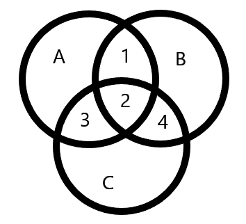
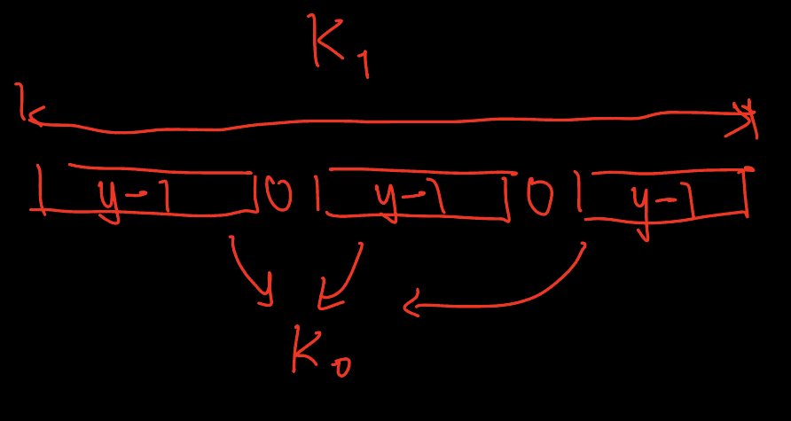

# 2025

## Round [#1055](https://codeforces.com/blog/entry/146988) (Div.1 + Div.2)

### A. Increase or Smash
??? note "Details"
    * Thought in the contest:
    
    直接模擬過程，有仔細思考很不錯，但是速度偏慢，可以先使用比較簡單的範例。


### B. Catching the Krug
??? note "Details"
    * Thought in the contest:

        一開始想到了要往四個角落走，並且同時想到了可以使用9宮格確認兩個人的相對位置，但是在如何確定該怎麼選擇要往哪走時卡住了。

    * Solution:

        \[
        r_{dis} = \left\{ 
        \begin{array}{ll}
            r_k < r_d \to r_d\\
            r_k > r_d \to n - r_d\\
            r_k = r_d \to 0
        \end{array}
        \right.
        \]

        \[
        c_{dis} = \left\{ 
        \begin{array}{ll}
            c_k < c_d \to c_d\\
            c_k > c_d \to n - c_d\\
            c_k = c_d \to 0
        \end{array}
        \right.
        \]

        用簡單的貪心可以發現，Doran必須要往邊界走，而Krug則是要往Doran的遠離方向走，則Doran抵達邊界的距離為 $max(r_{dis}, c_{dis})$ 。

### C. Triple Removal

* tag: prefix sum

??? note "Details"

    * Thought in the contest:

        觀察到需要三個分成一組，所以可以利用前綴和 O(1) 計算 [l, r] 中有多少 1/0，當 1/0 的個數無法整除3時回答 -1 。因為 cost 為三個 $idx_i, idx_j, idx_k$ 一組中兩兩之間 $min(d_{i, j}, d_{j, k})$ 距離，此時該怎麼將 [l, r] 分組? 
        
        * <span style="color:red">簡單的貪心將最近的三個idx分成一組。這邊思考錯誤 !!!</span>

        * <span style="color:red">題目沒讀清楚!消除三個元素後，剩下的元素會合併成一個新的陣列。</span>

    * Solution:
        
        必須觀察出可能每次都可以挑出一對相鄰的pair加上某個元素進行消除 -> $|r - l + 1| / 3$

        除非 101010 或是 010101 ，這種一開始須要選隔兩個進行消除，然後再做跟原來一樣的操作 
        所以可以得到:

        1. 如果 $[l, r] % 3 != 0$ 

            -> -1

        2. 如果有 $l \le i \le r$ 且 $a_i = a_{i + 1}$

            -> |r - l + 1| / 3

        3. 無法使用 2. 的可能陣列為 010101... 或 101010...
            
            -> 2 + (r - l + 1 - 3) / 2 ，相當於消去三個元素，剩下的長度算結果

        如何判斷 010101/101010 ?
        利用01/10變化當作diff[i]，用前綴和的方式計算，若是整個區間都是10或是01則diff[i]都會是1，那區間和會等於區間長度

        <span style="color:red">這邊在實作的時候一直錯，因為我們詢問的區間是 [l, r]，所以變化的前綴和區間是 [l + 1, r] = diff[r] - diff[l]</span>

D. Division Versus Addition


## Educational Round [#183](https://codeforces.com/contest/2145) (Rated for Div. 2)

A. Candies for Nephews

### B. Deck of Cards

tag: greedy

??? note "Details"    
    
    * Thought in the contest:
        剛開始想說若是一遇到操作三後面的數字也都是會受到操作三的影響，但是從給出的測資無法跟我的想匹配，最後發現是要將操作三留到最後先使用操作一跟操作二。


### C. Monocarp's String

tag: prefix, sufix

??? note "Details"
    * Thought in the contest:

        所求為移除一段 subarray 使得剩下的 a 和 b 個數相等。馬上想到前綴和總合為0的轉換技巧，但是在計算移除最小的 subarray 時卡關。
        原本想說 利用 pre - x = 0 移項的方式找 x = pre 的長度，但是這樣是錯的!

        中間有想到將全部的陣列重複一次拼接成一個 2 * n 的陣列，並且求出最長 pre = 0 的 subarray，但是這種作法需要處理兩端相交的情形，以及
        初始為空的情況，變得很複雜。

        <span style="color:red">第一個解法其實隱約覺得有點怪怪的，可能還是要盡可能嘗試想個反例</span>
        
        <span style="color:red">想得太複雜應該要重新reset，整理現有的資訊重新思考</span>

    * Solution:

        比賽結束後想到應該是要做前後綴分解才對，先計算後綴和，並且將後綴和分組儲存其 index 值，枚舉前綴合的時候，需要找的是可以 pre[i] + suf[j] = 0
        的對應後綴和 index 此時必須 i < j 。對於前後綴和為 0 的情況必須特別討論，因為為 0 時可以不需要另一半前/後綴就可以為 0。

D. Inversion Value of a Permutation

## Round [#1057](https://codeforces.com/blog/entry/147264) (Div.2)

A. Circle of Apple Trees

### B. Bitwise Reversion

??? note "Details"

    * Thought in the contest:
        
        <span style="color:red">Attention is all you need!!!</span>

        一開始讀完題目沒有很好的思路，接著嘗試將每個bit列出來，也沒有想法，最後把 a, b, c 當成 set 把圖畫出來，並且配合 bit 才想到是不是去掉所有的交集後剩下的交集要各自獨立才能滿足題目的不等式。

        \[
        \left\{ 
            \begin{array}{ll}
                a \& b = (1) + (2) = x \\
                b \& c = (2) + (4) = y \\
                a \& c = (2) + (3) = z
            \end{array}
        \right.
        \]

        去掉 $a \& b \& c = (2)$ 後 (1), (3), (4) 必須各自獨立也就是說兩兩必不會有交集，否則與題目的限制會有矛盾。

        [code](https://codeforces.com/contest/2153/submission/342973774)

        

### C. Symmetrical Polygons

??? note "Details"

    * Thought in the contest:

        這題雖然一開始就有一個很直觀的想法，但是中間因為 edge case 卡住導致直到比賽結束都沒有做出來，不然應該算是一題秒殺題。

        基本的想法就是對長度進行分組，對於某個長度 x 數量 > 1 的邊可以將其分到兩個組別 a, b，接著將剩下一個的邊按照順序放到一個陣列當中。

        接著要利用 a, b 中的邊組合出多邊形，我們可以使用 1, 2 個邊組合出多邊形。並不是任何的邊都可以組合出多邊形，以三角形為例子，其中兩個邊必定要大於第三邊，用腦內思考就很容易得到。

        讓我卡住的地方是

        1. <span style="color:red">對於額外兩個邊(c, d)的情況必須要 a + b + c > d ，否則會無法形成多邊形</span>
            
            [-a-] [-c-] [-b-]

            [--------d--------]

        2. <span style="color:red">雖然想到上面的條件但是還有一個部分，但是有可能最大的幾條邊都沒辦法滿足，所以其實要遍歷陣列分別加一條邊的情況，或是兩條邊的情況，取最大值。</span>

        [code](https://codeforces.com/contest/2153/submission/343028233)

### D. Not Alone

??? note "Details"

    * Thought in the contest:

        一看到題目聯想到了打家劫舍的問題，因為一旦選了往前或往後其中一個方向必須相同那就似乎可以用類似打家劫舍的方式定義狀態。但是對於轉移方程沒辦法很好的確定。想了很久都沒辦法突破。

    * Solution:

        偷看了提示後發現要分成 2 個 和 3 個元素做劃分型DP，一旦知道分成 2 個或是 3 個後，想使用遞推的方式做DP但是發現有點難定義初始值，最後用記憶化搜索很順利的就完成了。

        * <span style="color:red">分成 2 個做劃分很容易想到，但是分成 3 個做劃分的思路要仔細的理解，因為這是這題的關鍵</span>

            * 這題跟打家劫舍還是不一樣。首先把陣列切割成長度為 2 的區塊，此時很容易發現長度為 3 的陣列無法用長度為 2 的區塊組合而成，此時應當想到要用長度為 3 的區塊做劃分。對於長度 > 4 的區塊可以把它切割成 長度為 2 和 3 的兩種區塊組合。

        * <span style="color:red">雖然用記憶化很容易實作，但還是要練習先在白板上寫記憶化的 pseudo code 之後再轉成遞推的形式，因為怕之後可能遇到沒辦法用記憶化的題目</span>

        [code](https://codeforces.com/contest/2153/submission/343085025)

        * <span style="color:red">對於環形陣列的處理，可以學習 [jiazhichen844](https://codeforces.com/contest/2153/submission/342948873) 的處理，將 多出來的部分拼接在陣列的前後，接著就是當作普通的陣列做計算</span>

        [code](https://codeforces.com/contest/2153/submission/343153883)

        ```cpp
        auto dp = [&](int offset) -> LL {
            vector<LL> f(n + 1, invalid);
            f[0] = 0;
            f[2] = costA(0 + offset, 1 + offset);
            for(int i = 2; i < n; ++i) {
                f[i + 1] = min(f[i - 1] + costA(i - 1 + offset, i + offset), \
                                f[i - 2] + costB(i - 2 + offset, i - 1 + offset, i + offset));
            }
            return f[n];
        };
        ```

        * <span style="color:red">注意 f 和 cost 使用的下標是不一樣的意思 </span>

## Round [#1059](https://codeforces.com/blog/entry/147242) (Div.3)

### A. Beautiful Average

### B. Beautiful String

??? note "Details"

    * Thought in the contest:

        一開始沒看懂題目，wa 了一發，之後仔細看了一下題目然後過了。

### C. Beautiful XOR

### D. Beautiful Permutation

??? note "Details"

    * Thought in the contest:

        第一次寫交互題，調了很久輸入輸出最後時間快到才調好，賽後沒過多久就過了。

    * <span style="color:red">交互題的模板要整理好</span>

### E. Beautiful Palindromes

??? note "Details"

    * Thought in the contest:
        
        有想到核心想法，只要確保回文中心無法構成，那就無法構成。

    * Solution:

## Round [#1061](https://codeforces.com/blog/entry/147761) (Div.2)

### C. Maximum GCD on Whiteboard

??? note "Details"

    * Thought in the contest:
        
        比賽的時候有想到利用不等式 $x \le y + x \le kx$，但是之後就卡住沒辦法往下推。

    * Solution:

        考慮若是 g 作為答案要如何拆分 $X = x_1 + x_2 + x_3$:

        (1) 非常明顯的若是 $X \le 4g$ 無法將 X 拆分使得 $x_1, x_3 \ge g$，所以只能選擇 $X = g, 2g, 3g$

        (2) 若是 $4g \le X \le 5g$，我們可以這樣分配 $x_1 = g, x_2 = g + (X \% g), x_3 = 2g$

        (3) 若是 $X \ge 5g$，我們可以這樣分配 $x_1 = g, x_2 = g + (X \% g), x_3 = 3g$

        * <span style="color:red">分類討論的能力要加強</span>

        (4) 接著是如果用 $g = 1, 2, 3, .. n$ 去遍歷陣列時間複雜度會是 $O = (n^2)$ ，所以我們需要一個方式可以 $O(1)$ 得到陣列中 $g, 2g, 3g, \ge 4g$ 的元素個數 -> 前綴和

        * <span style="color:red">用值域方式思考</span>

        [code](https://codeforces.com/contest/2156/submission/345729493)

## Educational Codeforces Round [#184](https://codeforces.com/blog/entry/148390) (Rated for Div. 2)

### D1. Removal of a Sequence (Easy Version)

??? note "Details"

    * Thought in the contest:
        
        這題主要的問題是，讀題的時候理解錯誤，一開始讀題的時候就對於題目給的參數 x 不太理解，加上題目的圖解以為是要將，[y, y + x] 的倍數刪除找第 k 個數。
        所以雖然中途有想過使用二分但是理解錯誤的關係所以卡住。

    * Solution:

        題目真正的意思是不斷將第 y 倍數位置的數刪除 x 次後，問第 k 個數是多少。
        這樣可以很容易的用二分計算，check函數就是不斷的將要檢查的數 p 減去 y 的倍數也就是 $\lfloor \frac{p}{y} \rfloor$，減去 x 次後判斷是否 $p' \le k$。

        [code](https://codeforces.com/contest/2169/submission/349316238)

### D2. Removal of a Sequence (Hard Version)

??? note "Details"        

    * Solution:

        困難版的關鍵在，當看到 $x \le 10^{12}$ 時會發現無法用二分，因此需要一個更好的方式計算 k 。從簡單版本的例子發現當 $p' = p - \lfloor \frac{p}{y} \rfloor$ 的時候，假設 $s = \lfloor \frac{p}{y} \rfloor$，則可以有:

        \[
        \left.
            \begin{array}{ll}
                p' = p - s  \\
                p''= p' - s' \\
                ...
            \end{array}
        \right.
        \]

        從 $s = \lfloor \frac{p}{y} \rfloor$ 可以知道， $s = s' = ... s^a$，表示我們可以透過加一段變化量得到 $p^a = p - a \times s$。

        接著我們要從已知的條件推回所求，$k_0 = k_1 - \lfloor \frac{k_1}{y} \rfloor$，$k_0$ 為一開始的輸入，也就是不斷的減去 $\lfloor \frac{p}{y} \rfloor$ 後得到的 k。

        可以將 $k_0 = k_1 - \lfloor \frac{k_1}{y} \rfloor$ 看成下面這張圖:

        

        從反向可以有等式 $k_1 = k_0 + \lfloor \frac{k_0}{y - 1} \rfloor$，由上圖可以發現若是使用 $\lfloor \frac{k_0}{y - 1} \rfloor$ 剩下來的部份可能會導致加回去的時候加過頭，所以要調整等式為:

        \[
        \left.
            \begin{array}{ll}
                k_1 = k_0 + \lfloor \frac{k_0 - 1}{y - 1} \rfloor  \\
                k_2 = k_1 + \lfloor \frac{k_1 - 1}{y - 1} \rfloor \\
                ... \\
            \end{array}
        \right.
        \]

        接著設

        \[
        \left.
            \begin{array}{ll}
                d_0 = \lfloor \frac{k_0 - 1}{y - 1} \rfloor  \\
                d_1 = \lfloor \frac{k_1 - 1}{y - 1} \rfloor \\
                ... \\
                d_a = \lfloor \frac{k_{a - 1} - 1}{y - 1} \rfloor \\
            \end{array}
        \right.
        \]

        可以從上面的圖知道每次的增加量不一定會改變，也就是 $d_0 = d_1 = ... = d_{a - 1} < d_a$。

        由上圖可以知道若是不斷增加 $d_0$ 直到 增加量為 y - 1 會使得 $\frac{k_a - 1}{t} = d_0 + 1$，設 $t = y - 1$。

        而 $\frac{k_0 + a \times d_0 - 1}{t} = \frac{k_a - 1}{t} = d_0 + 1$
        
        式子代換後得到 $\frac{(d_0 + 1)t - (k - 1)}{d_0} = a$

        因為是做整數除法，所以要對 a 做上取整，$\lceil \frac{(d_0 + 1)t - (k - 1)}{d_0} \rceil = \lceil a \rceil = \frac{(d_0 + 1)t - (k - 1)}{d_0} + 1$

        [video](https://www.bilibili.com/video/BV1cpy3BVEoV/?spm_id_from=333.788.videopod.sections&vd_source=caaccd1459c5ece44b5e2d37804871b8&p=5)

        可以用這個影片幫助理解，但是後面求a的部分不太直覺，上面敘述會比影片更好理解。

        [code](https://codeforces.com/contest/2169/submission/350812314)

## Educational Codeforces Round [#185](https://codeforces.com/blog/entry/148798) (Rated for Div. 2)

### B. Addition on a Segment

??? note "Details"

    這題被 rejudge 了，因為沒有開 long long。

    另外這題可以不用先 sort，因為我們只關心 > 0 的元素個數和元素和。只需要知道 n - 1 次是我們可以任意操作的，多出來部分要將其分給 元素為 1 的時候。
    
### E.

## Round [#1068](https://codeforces.com/blog/entry/148981) (Div.2)

### D. Taiga's Carry Chains

??? note "Details"

    比賽的時候觀察到操作的次數如果夠多則最後的結果會是 2 的次方。所以若是可以操作的 k 超過最高位則可以貪心將所有位元 1 由低位操作至最高位。但是問題出在如果 k 比較小的時候該如何操作，比賽的時候想的是將連續的 1 進行分組後想辦法從多的組選到少的。這個方法會有一個問題，多選到少會橫跨一些其他的組，所以不一定是最好的。

    * Solution:

        觀察 1101 若是操作在 bit 0, 1 的位置後可以得到 1 0000 並且可以得到 cost = 4，接著用這個例子延伸 n = 1000 1101 0011 同樣的操作在 bit 4, 5 得到 n' = 1001 0000 0011 拿到同樣的貢獻 4。可以知道 popcnt(n) = 6, popcnt(n') = 4，可以知道操作後 bit 1 會相差 2，總共的 cost = 2 + 2(k)。
        
        可以知道每次操作都會操作在 bit 1 上，因為操作在 0 上對 cost 沒有任何貢獻。所以至少會有 cost = k，此外從上面的例子可以發現操作完後 1101 這個 pattern 都會變成 2 的次方，加上原本的部分可以得到通式 => cost = popcnt(n) + k - popcnt(n')

        我們需要求的是 max(cost) = max(popcnt(n) + k - popcnt(n'))，可以知道 popcnt(n) + k 是固定值，因此我們要求的是 min(popcnt(n')) 得到最大值 max(cost)。

        另外從上面的結論可以知道若是 k > hi bit 則可以透過貪心的方式得到 2^(hi + 1) 此時的 cost = popcnt(n) + k - 1。

        若是 k <= hi 由上面的討論知道無法使用貪心的方法，但是由題目的限制可以知道 $n < 2^{30}$，所以 hi bit <= 29，此時應該要想比較暴力的方式，可以思考 dp 枚舉的方式，對於第 i-th 位元操作我們可以使用操作或是不使用，而此時我們會因為 (i-1)-th bit 是否有進位而影響當前是否需要 j 操作，可以發現此時我們的問題變成前 (i - 1)-th 的情況下 且剩下 j - 1 操作 如何使前 i-1 的 popcnt 最小，若是不操作則是 (i - 1, j)。此外我們必須記錄進位情形。

        可以定義 f(i, j, c) 為在前 i 位，使用了 j 操作，c 為 (i - 1)-th 是否有進位，我們可以得到的最小 popcnt。

        * 用刷表法向後更新會比較好思考。

        可以知道初始值是完全不操作 f(0, 0, 0) = 0，其他則是 invalid = inf 。

        若是當前 f(i, j, c) 為 inf -> 無法向後更新
        
        設 n 的第 i-th bit 為 $b_i$，可以有使用操作和跳過兩種選擇:

        1. 跳過

            $f(i + 1, j, (c + b_i) >> 1) = f(i, j, c) + ((c + b_i) \& 1)$

        2. 使用操作

            if j + 1 <= k:
                
            $f(i + 1, j + 1, (c + b_i + 1) >> 1) = f(i, j, c) + ((c + b_i + 1) \& 1)$
    
    * 這個方法為 editorial 的方法可以看出來用疊代的方式寫的話會有點難思考清楚。
    
    [code](https://codeforces.com/contest/2173/submission/352422884)

    * [maspy](https://codeforces.com/contest/2173/submission/352034270) 的記憶化搜索會相對來說更好的理解，

    只要觀察第 0 bit 我們是否要對其進行操作，

    1. 若是 n & 1 == 0

        那不需要做任何操作 -> dfs(n, k) = dfs(n >> 1, k)
    
    2. 若是 n & 1 == 1

        那不做任何操作 -> dfs(n, k) = min(dfs(n, k), dfs(n >> 1, k) + 1)

        因為我們會剩下 1 bit

        做操作 -> dfs(n, k) = min(dfs(n, k), dfs((n + 1) >> 1, k))

        做操作後 bit 1 -> bit 0 接著要進行進位 (n + 1) >> 1


    [code](https://codeforces.com/contest/2173/submission/352405373)

## Codeforces Global Round [#31](https://codeforces.com/blog/entry/149318) (Div. 1 + Div. 2)

### A. Carnival Wheel
    
這題其實只要暴力就可以過了，但是看到題目其實想到了斐蜀定理結果花更多時間去想。

Sol:

由貝祖定理可知當 $d = gcd(l,b)$, 可達位置為:

$$a, a + d, a + 2d, ... (\text{mod l})$$

如果 a = 0 那最大可達位置為 l - d。

加上 offset a 後必須加上位移 $l - d + a \pmod d$

### B. Ashmal

這題原本想用貪心的方式加入將要加入的 a[i] 與 s 的開頭或是結尾的 a[j] 判斷大小決定加在哪，但是後來發現這樣沒辦法使最後構造的字串最小。

最後是用最樸素的作法 s = min(a[i] + s, s + a[i])

### C. XOR-factorization

對於 k 為奇數時的貪心很直覺的為將所有的元素設為 n 可以得到最大的 xor 值。

但是對於 k 為偶數時，若是採用同樣直覺的策略，像是 k - 1 元素設為 n 或是 k - 2 元素設為 n 。兩種策略都會卡 testcase 2。

因此思考按位元貪心，由 n 的最高位逐位貪心至最低位。這個方法會需要考慮到元素值域的限制，每個元素不能超過 n。

當由大到小逐位元貪心的同時要考慮到前面所選的位元是否仍是 n 的前綴(數位枚舉的思想)，若是前綴已經小於 n 那剩下的部分可以隨意的填入，若是仍然為 n 的前綴那必須確認不能超過 n。

當第 i 位元遇到 1 的時候，將奇數個元素的第 i 位設為 1，貪心的會希望將 k - 1 個元素第 i 位設為 1。對於剩下一個需要填 0 的元素此時的前綴已經小於 n，表示後面不管怎麼填都不會超過 n -> 貪心的盡量讓每個元素都變成前綴小於 n(表示遇到幾個 1 就讓幾個元素小於 n)。

上面的貪心方式的好處在於，當遇到第 i 位元為 0 的時候，若是元素的前綴等於 n ，那其元素第 i 位仍然必須填 0，可是當前綴已經小於 n 的時候那就可以盡量的填入 1，所以可以貪心的將偶數個小於 n 的元素填入 1。

講解:

[video1](https://www.bilibili.com/video/BV18PqCBFETp?t=211.5)

[video2](https://www.bilibili.com/video/BV1ddBTBrE9s?t=547.8)

