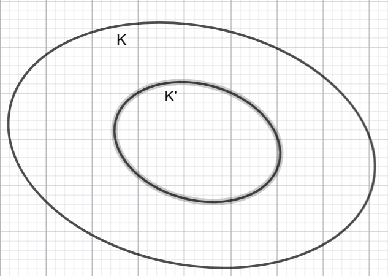
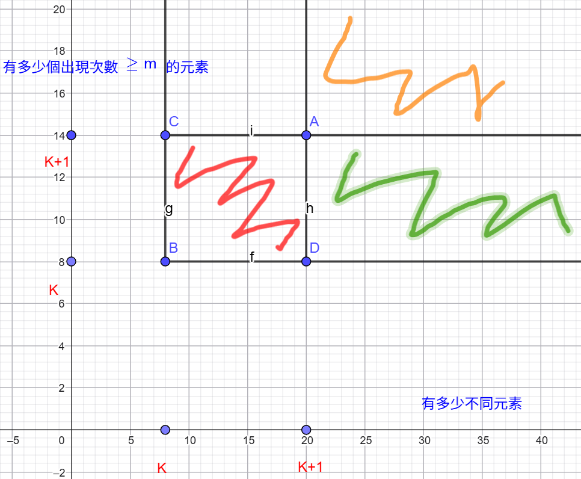
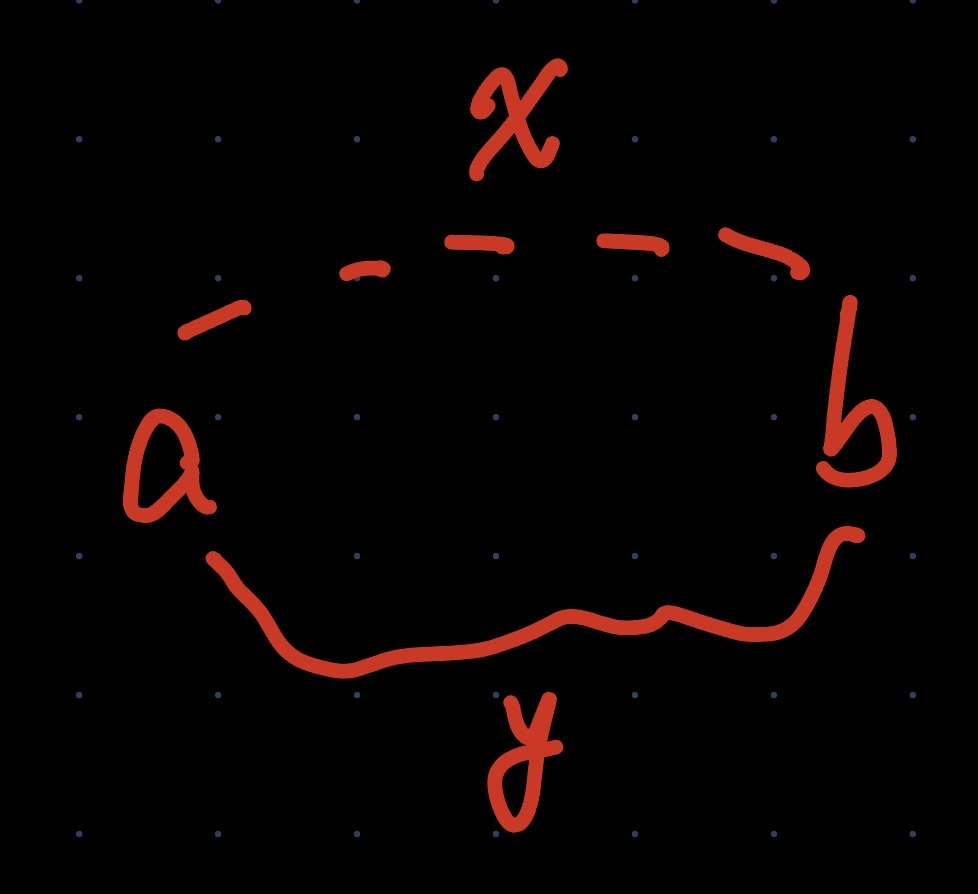

# 2026 S1

## Weekly contest [#483](https://leetcode.cn/contest/weekly-contest-483/)

因為網路的關係這場 unrated

Q4. Minimum Cost to Merge Sorted Lists

狀壓 DP + 二分算中位數，一開始還想用複雜的對頂堆維護算中位數，後來看到有人說二分馬上想出來，比賽的時候有可能因為這樣就沒寫出來。

---

## Biweekly contest [#173](https://leetcode.cn/contest/biweekly-contest-173/)

雙周賽補題

Q3. Find Maximum Value in a Constrained Sequence

做來回兩次遍歷陣列，第一次由左向右使陣列維持 diff 和 restrictions 的限制，第二次由右向左調整使得 restrictions 的限制符合 diff 。

Q4. Count Routes to Climb a Rectangular Grid 

前綴和優化 DP，這題沒有很難但是要想清楚陣列如何轉移，以及前綴和的處理。

---

## Weekly contest [#484](https://leetcode.cn/contest/weekly-contest-484/)

Q3. Count Caesar Cipher Pairs

因為回傳值寫錯忘記改卡了好久。

Q4. Maximum Bitwise AND After Increment Operations

雖然一開始有想到要逐位元做貪心，想用排序後由大至小找大小為 m 的子集，但是這種貪心是錯的，因為比較大的元素不代表成本比較少。

這題還是要從貢獻法下手。假設我們想要使子集 AND 後得到 target t，表示有 m 個元素 $x_i$ 做完操作 ${ops}_i$ 後可以得到 $(x_i + {ops}_i) \text{ \& } t = t$，我們的目標是使 $\sum_{i = 0}^{m - 1}{{ops}_i} \le k$，能得到最大的 target t 。

對於第 j 位元 $b_j$，元素 $x_i$ 我們要知道 $x_i$ 要做多少操作才可以使 $b_j$ 為 1，我們可以寫成這樣 $ops_{(i,j)} = b_j - (x_i \text{ \& } ((b_j << 1) - 1))$，因為我們只關心比 $b_j$ 小的位元的貢獻，得到貢獻後可以用快排或是快速選擇，如果前 m 最小貢獻 $\sum_{i = 0}^{m - 1}{{ops}_i} \le k$ 表示可以透過操作得到 $b_j$。

因為答案要求最後的目標 t 儘量大，所以從最大的位元往低位計算可能的 t，若是最後得到的 $\sum_{i = 0}^{m - 1}{{ops}_i} \le k$ ，表示當前的 $b_j$ 可以加入 t，而我們需要利用這個 t 去計算貢獻

---

## Weekly contest [#485](https://leetcode.cn/contest/weekly-contest-485/)

Q2. Maximum Capacity Within Budget

這題我用的是 sort + bit，但是可以用 sort + monotonic stack

Q4. Lexicographically Smallest String After Deleting Duplicate Characters

這題腦袋不清楚，理解錯題意，以為是要用兩種字母配對，結果題目意思是可刪除的字母出現兩次以上。

基本的貪心思想是，要使比較小的字母儘量靠前，因此按順序遍歷，一旦遇到比較小的字母就把前面的刪除。

最後得到的答案還要再次維護使得答案長度儘量小。

---

## Weekly contest [#486](https://leetcode.cn/contest/weekly-contest-486/)

Q4. Find Nth Smallest Integer With K One Bits

這題很快就想到用組合數算有 m 個 1 和 n 個 0 的組合數是 $C_{m + n - 1}^{m}$，所以可以計算出需要有幾個 0 才能構造出答案

但是這個方式讓我在構造答案的時候完全卡住。

這題考的是試填法，真正的做法是由高至低位按位元填入。假設目前在第 i bit 填 0 ，那接下來要在剩下的 p 個位置填 k 個 1 的方案數為 $\binom{p}{k}$ ，若此時 $n \le \binom{p}{k}$，表示第 n 個數會在 $\binom{p}{k}$ 的方案數中，所以第 i bit可以填 0，否則要填 1，然後將問題規模縮小成在剩下的 p - 1 個位置填 k - 1 個 1 的方案數，並將 $n = n - \binom{p}{k}$。

---

## Weekly contest [#488](https://leetcode.cn/contest/weekly-contest-488/)

Q4. Maximum Score Using Exactly K Pairs

比賽的時候一直往枚舉選哪個的方向去思考，結果最後卡住沒寫出來，賽後觀察發現是子序列 DP 選或不選後馬上解決。

子序列DP:

相鄰相關 -> 選或不選
相鄰無關 -> 枚舉選哪個 e.g. 最長遞增子序列 LIS

---

## Weekly contest [#489](https://leetcode.cn/contest/weekly-contest-489/)

Q3. Longest Almost-Palindromic Substring

一開始看到題目想用 DP 的方向思考，但是發現對於使用跳過操作後的轉移有點難以解決，中間雖然有想過使用刷表法，但是還是沒有做出來。

最後解答是中心擴展法，雖然中間有想過使用這個方式，但是沒想到我的模板居然有寫錯，最後沒有發現，其實這題很簡單，不需要使用DP的方式就可以算出來，因為 n 很小。

Q4. Maximum Subarray XOR with Bounded Range

這題一開始看到最大最小馬上反應到單調隊列，但是對於找 subarray 中的最大 XOR 沒有想法，雖然想說是不是使用前綴和之類的想法但是嘗試了一下之後回去想 Q3。

看了解答後發現，使用前綴和的想法沒有錯，但是最後找子陣列中最大 XOR 的方法是要使用 0/1 trie 解決，假設當前綴和為 1100，我們想找的另一個可以組成最大的值為 0011，因此我們要利用 0/1 trie 沿著最高位找是否有對應的值在子陣列。

---

## Weekly contest [#490](https://leetcode.cn/contest/weekly-contest-489/)

Q4. Count Sequences to K

看到數據範圍一開始往子集狀壓去想，沒想到時間複雜度 $O(3^n)$ 會 TLE ，此外我的想法是枚舉子集的方法會是枚舉不選的個數，然後枚舉剩下的子集分給乘法或是除法找兩邊相等的子集。這個方法會重複統計導致錯誤，因此只能暴力 $O(3^n)$。

觀察到 $nums[i] \le 6$ 所以質因數只會有 2, 3, 5 因此可以定義 $f(i, e2, e3, e5)$ 為在前 i 個元素做乘法或是除法後質因數剩下的個數。所以會有三種可能，不選、除法、乘法:
$$f(i, e2, e3, e5) = f(i - 1, e2, e3, e5) + f(i - 1, e2 + x, e3 + y, e5 + z) + f(i - 1, e2 - x, e3 - y, e5 - z)$$

初始值為 $f(-1, 0, 0, 0) = 1$

我的思路應該要往折半枚舉去思考，時間複雜度會是 $O(3^{n/2})$，枚舉一半的所有 $\frac{x}{y}$，可以用 $gcd(x, y)$ 找最簡分數。

---

## Weekly contest [#491](https://leetcode.cn/contest/weekly-contest-491/)

Q3. Minimum Bitwise OR From Grid

這題雖然看出來是試填法，但是腦袋完全卡住寫不出來。

基本上就是先填看看 0 ，然後看能夠選的選的元素中是否有符合當前bit為0的元素。

怎樣能夠選? 已經選了前綴 mask ，我們剩下能選的部分是"前綴 + $2^i - 1$ 的子集。
 
Q4. Count Subarrays With K Distinct Integers

因為恰好 k 個不同整數很難處理，可以轉換成至少 k 個不同的整數 $cnt(k) - cnt(k + 1)$。$k' = k + 1$

k' 為 k 的子集



這題要特別注意的部分是中間判斷的部分，若是在計算 $cnt(k + 1)$ 時單純用 k + 1 判斷 $\ge m$ 的元素，會減去的部分是圖中黃色的區域，而我們想求的部分會是紅色的區域，綠色的區域則會是我們漏掉的區域。

因此判斷的時候要判斷

* $cnt(k)$: 

    subarray 中至少包含 k 個不同整數。
    
    在 subarray 中，有至少 k 個數，每個數出現次數都是 $\ge m$ 的

    也就是 $cnt(k) = $ 紅色 + 綠色 + 黃色部分

* $cnt(k + 1)$: 

    subarray 中至少包含 k + 1 個不同整數。
    
    在 subarray 中，有至少 k 個數，每個數出現次數都是 $\ge m$ 的

    也就是 $cnt(k + 1) = $ 綠色 + 黃色部分



---

## Weekly contest [#492](https://leetcode.cn/contest/weekly-contest-492/)

Q2. Find the Smallest Balanced Index

這題是看起來簡單的前後綴分解，但是應該會被 hack。

雖然有考慮到由後往前遍歷以避免溢出，但是在最後快要溢出的情況沒有考慮清楚。

錯誤的寫法:

```cpp
for(int i = n - 1; i >= 0; --i) {
    int &x = nums[i];
    sum -= x;
    prod *= suf;
    if(sum == prod) {
        return i;
    }
    if(prod >= sum) break;
    suf = x;
}
```

* 由於 $nums[i]>0$，所以 sum 是嚴格遞增的，prod 是（非嚴格）遞減的。畫出函數圖像的話，至多有一個交點。

構造陣列 $[10^9, .... 10^9, 1, 10^9, 100, 10^9]$，假設 1 前面有 100 個 $10^9$

在元素 x = 1 的時候前綴和為 $10^9 * 100 = 10^{11}$，後綴乘積為 $prod \times suf = 10^{11} \times 10^9 = 10^{21}$ 會造成溢出。

因此要將判斷式移項 $prod * x > sum \rightarrow prod > \frac{sum}{x}$

Q4. Minimum Cost to Partition a Binary String

這題一開始想用 divide-and-conquer，但是不知道為什麼卡住，最後用 DP + 倍增的方式寫出來。時間複雜度為 $O(n\log{n})$

最後，用貪心由上往下搜索可以有 $O(n)$。

---
## Weekly contest [#493](https://leetcode.cn/contest/weekly-contest-493/)

Q3. Longest Arithmetic Sequence After Changing At Most One Element

這題因為一直想用 DP 的方式實作，但是一直卡在一些 edge case。中間雖然有想到使用前後綴分解，但是沒有想到如何計算前後綴。

其實只要分別討論前後是否能構成等差數列就可以利用前後綴分解。

這題要注意的是會有許多 case 要想清楚:

1. X O O 
2. O O X
3. O  X O O
4. O O X O
5. O O X O O

上面這五種是需要討論的情況，(1) 、 (2) 這兩種可以在計算前綴的時候將最大值 + 1 即可以得到。

下面 (3)、(4)、(5) 使用 X 兩端作為差值，用差值判斷可否接上左右兩端，要注意的是差值要是偶數才可以計算。

將邏輯提取出來可以簡化程式碼:

```cpp
for(int i = 1; i < n - 1; ++i) {
    int diff = nums[i + 1] - nums[i - 1];
    if(diff % 2) continue;

    /*將邏輯分開寫*/
    bool left = i > 1 && nums[i - 1] - nums[i - 2] == diff / 2;
    bool right = i + 2 < n && nums[i + 2] - nums[i + 1] == diff / 2;

    if(left && right) {
        ans = max(ans, pre[i - 1] + suf[i + 1] + 1);
    } else if(left) {
        ans = max(ans, pre[i - 1] + 2);
    } else if(right) {
        ans = max(ans, suf[i + 1] + 2);
    }
}
```

Q4. Maximum Points Activated with One Addition

這題賽後一看是找兩個最大的連通塊。

這題的難點會是如何將節點 (x, y) 連在一起，利用 (x, 0), (0, y) 作為中間節點，將其他節點連在一起。

這題要注意的是使用 hash 將 x 和 y 編碼一起使用 long long 當作 hash table 的 key。

---

## Weekly contest [#494](https://leetcode.cn/contest/weekly-contest-494/)

Q2. Count Commas in Range II

* 不熟悉二分函示庫

二分沒有找到會回傳 end() ，要注意!

Q3. Longest Arithmetic Sequence After Changing At Most One Element

賽後看到 n = 40，馬上想到折半枚舉，比賽中的時候因為想到試填法結果完全沒頭緒，卡了很久。

* 以後審題不應該馬上就鐵頭往某個做法深入，應該先觀察所有線索再確定方向，因為每次都因為這樣導致方向錯誤回不來。

* 找最少可移除元素 $\leftrightarrow$ 就是找最多可保留的元素

XOR 就是不用進位的加法，以後可以先假設若是一般加法該怎麼做? 這題是簡單 0-1 背包問題。

Q4. Maximum Points Activated with One Addition

比賽中雖然有想到做法，但是最後卡在相鄰相同元素的貢獻沒想好怎麼處理最後卡住，賽後才寫完，如果第三題有馬上寫完的話應該可以把這題做完。

* [logtrick 解法](https://slipet.github.io/5lipet/greedy/bitmask/#logtrick)

---

## Weekly contest [#495](https://leetcode.cn/contest/weekly-contest-495/)

Q3 - Sum of Sortable Integers

[因子個數約為 $\sqrt[3]{n}$](https://slipet.github.io/5lipet/math/number_theory/#_5)

這題直覺地用枚舉因子，用暴力的方式解決，我的實作複雜度會是 $O(n\sqrt[3]{n})$。

* 一個更進階的優化方式，紀錄下一個逆序位置，跳過中間連續升序的位置

Q4 - Incremental Even-Weighted Cycle Queries

比賽的時候因為 Q3 想太久，這題沒有很好的思考，最後有想過是否要使用 DSU，但是對於一些情況沒有辦法想清楚:

```cpp
   /_\           /_\ 
/_\ _ /_\       /
```

像是上面多個環的情況，以及一個環然後接著一條邊得情況，不知道將邊權用什麼方式處理。

* Solution:

觀察題目，整理一些資訊:

1. 由於邊權只會有 0/1，因此不用考慮關於 0 的邊權。
2. 題目只關心環上和的奇偶性，因此將加法看成邊權的 XOR 為 0
3. 如果邊的兩端不屬於同一連通塊，直接連邊，這表示不論是橋或是單純由環長出來的邊都可以加入答案。
4. 當我們有一條邊的異或和為 $x$ 要加入一個環的時候，代表也會有一條連邊有異或和為 $y$ 使得加入的邊可以構造出一個環，此時 $x \oplus y = 0$，也就是 $x = y$，如下圖

    


* 如何快速求出從 x 到 y 的路徑的異或和 $\rightarrow$ <span style="color:red">帶權並查集</span>

* 維護節點到其代表元 root r 的路徑 XOR 和
  
  由 a 到 b 的路徑 XOR 和可以拆成 $S_{\overline{ar}} \oplus S_{\overline{br}}$，重複的邊會因為 $\oplus$ 抵銷。
  
  就像下面這種情況

    ```cpp
        r
        |
       /_\ 
      a   b
    ```

---
