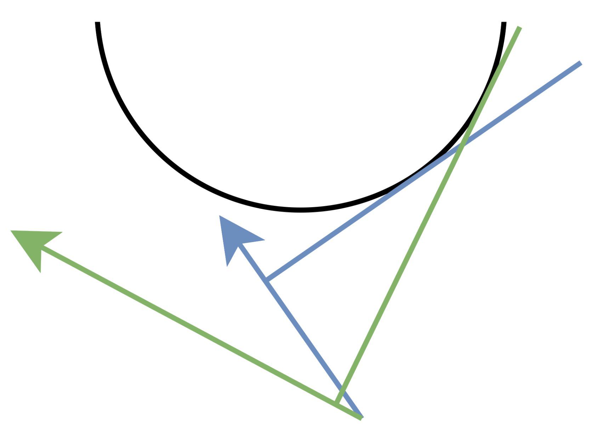

# Convex Hull Trick/凸包優化/斜率優化

如果可以將轉移方程表達為:

$$f_i = min_{j = 0}^{i - 1} (f_j + s_i s_j)$$

如果使用一般枚舉選哪個的方式計算的話會得到 $O(n^2)$ 的複雜度。

但若是使用向量的方式看這個式子會有不同的做法，將上面的等式用內積表示，此時我們要找的目標是在 $(s_i, 1)$ 上投影最小的向量:

$$f_i = min_{j = 0}^{i - 1} (s_j, f_j) \cdot (s_i, 1) $$

而此時我們只需要觀察由前 i - 1 個的點集所組成的下凸包，因為超過這個下凸包點其投影長度必定比凸包上的點還要長。

一但有了下凸包可以利用二分的方式找到投影長度最小的點(下凸包是一個單峰函數)。


這樣可以得到一個 $O(n\log{n})$ 的解

對於特殊性質的題目可以優化至 $O(n)$，若是 $(s_i, 1)$ 有單調性，可以利用單調對列進行優化(雙指針)，可以有 $O(n)$ 的複雜度。



<span style="color:red">凸包優化的實作重點是兩種向量的計算，一個是計算兩個向量的內積得到 $f_i$，一個是判斷當前點是不是可以加入凸包的外積</span>

練習:

單調對列優化:

[Leetcode 3826. 最小分割分数](https://leetcode.cn/problems/minimum-partition-score/solutions/3893573/hua-fen-xing-dp-xie-lu-you-hua-tu-bao-yo-5cb0/)

```cpp
using ll = long long;
struct vec {
    long long x, y;
};

vec sub(vec a, vec b) {
    return vec{a.x - b.x, a.y - b.y};
}

long long dot(vec a, vec b) {
    return a.x * b.x + a.y * b.y;
}

// 如果乘法会溢出，用 __int128
__int128 det(vec a, vec b) {
    return (__int128) a.x * b.y - (__int128) a.y * b.x;
}
class Solution {
public:

    const ll inf = LLONG_MAX / 2;
    long long minPartitionScore(vector<int>& nums, int k) {
        int n = nums.size();
        vector<int> sum(n + 1); // nums 的前缀和
        partial_sum(nums.begin(), nums.end(), sum.begin() + 1);

        vector<long long> f(n + 1, inf);
        f[0] = 0;
        vector<vec> q(n - k + 2);

        for (int i = 1; i<= k; i++) {
            int head = 0, tail = 0; // 模拟 deque

            long long s = sum[i - 1];
            q[tail++] = vec{s, f[i - 1] + s * s - s};


            for (int j = i; j <= n - (k - i); j++) { // 其他子数组的长度至少是 1
                s = sum[j];
                vec p = {-2 * s, 1};
                while (tail - head > 1 && dot(p, q[head]) >= dot(p, q[head + 1])) {
                    head++;
                }

                vec v{s, f[j] + s * s - s};
                f[j] = dot(p, q[head]) + s * s + s;
                while (tail - head > 1 && det(sub(q[tail - 1], q[tail - 2]), sub(v, q[tail - 1])) <= 0) {
                    tail--;
                }
                q[tail++] = v;
            }
        }
        return f[n] / 2;
    }
};
```