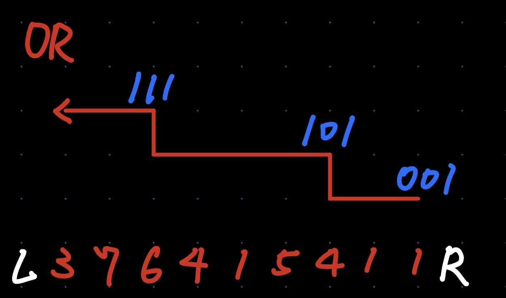
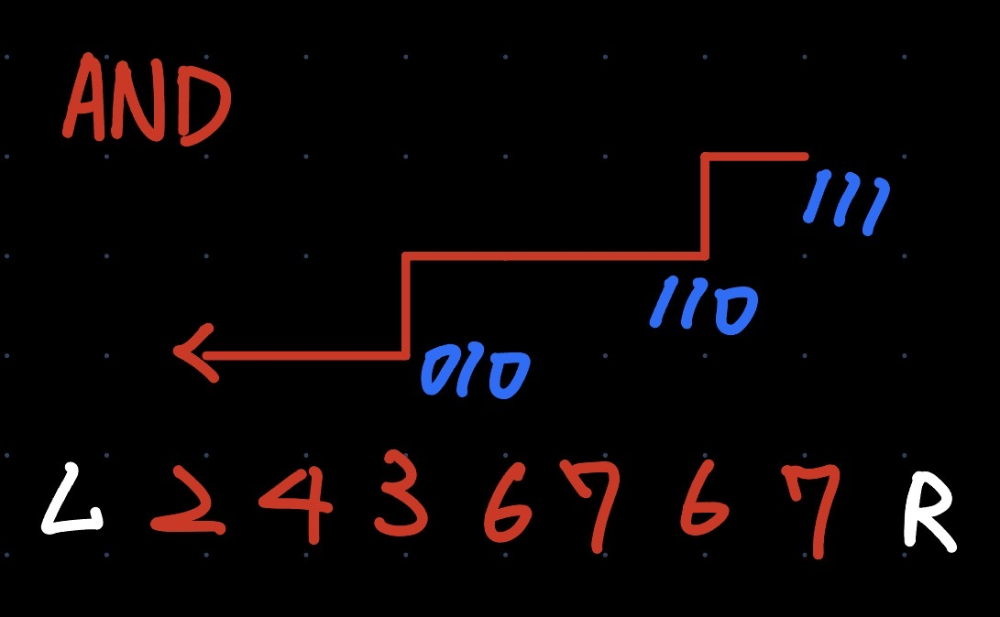

# Logtrick

* 單調性
* 應用場景:
  * 集合中的元素單調變化
  * **子數組 AND/OR/GCD/LCM/乘法/除法**
    * 乘法集合的變化也是單調遞增
  * 需要固定右端點，詢問左端點區間的時候
  * **支持維護區間**
  

對於位元運算的時候，不妨將每個元素的位元運算看成對不同集合做運算，也就是:

$$
\begin{aligned}
001 = \{b_1\}, 010 &= \{b_2\}, 011 = \{b_2, b_3\} \\ 
001 | 010 &= 011 = \{b_2, b_3\}\\
\end{aligned}
$$

由集合的角度出發，當遍歷陣列時，一旦固定右端點，不斷的往左進行 OR 運算，集合中的元素只會單調的增加，由陣列的元素值域 $[1, x]$ 可以知道集合的大小最大只會有 $\lfloor \log{x}\rfloor$。

若是做 AND 運算則集合的大小會單調遞減。

利用上面這個性質，我們可以將每次變化的位置記錄下來計算答案所需的部分。

由下面的圖片可以發現若是可以記錄下集合大小變化的位置，那就可以快速處理這些區間的資訊。



AND 運算會使集合大小單調遞減。



* 可以透過維護一個集合 set 由左往右遍歷陣列，為了維護陣列單調性，每次元素都要與陣列中的元素進行 OR/AND。

* 模板題:
    
  * Leetcode [#3878. 统计好子数组](https://leetcode.cn/problems/count-good-subarrays/solutions/3933380/mo-ban-logtrick-ji-lu-mei-ge-yuan-su-de-otgcv/)

    這題需要統計子陣列的個數，合法的子陣列為子陣列元素作或運算後得到的值 $v_{or}$ 出現在子陣列中。

    透過上圖可以觀察到，設右端點在 $i$，左端點在 $[l,r]$ 中的子陣列的 OR 都是 $v_{or}$。設 $j=pre[v_{or}]$。當 $j \ge l$ 時，左端點為 $l,l+1,...,min(r,j)$，右端點為 $i$ 的子陣列都包含 $v_{or}$，這一共有

    $$min(r,j)−l+1$$

    [ref.](https://leetcode.cn/problems/count-good-subarrays/solutions/3933380/mo-ban-logtrick-ji-lu-mei-ge-yuan-su-de-otgcv/)
    
    * 原地去重要看一下。


```cpp
class Solution {
public:
    long long countGoodSubarrays(vector<int>& nums) {
        vector<pair<int, int>> or_left; // (子数组或值，最小左端点)
        unordered_map<int, int> last;
        long long ans = 0;

        for (int i = 0; i < nums.size(); i++) {
            int x = nums[i];
            last[x] = i;

            // 计算以 i 为右端点的子数组或值
            for (auto& [or_val, _] : or_left) {
                or_val |= x; // **根据题目修改**
            }
            // x 单独一个数作为子数组
            or_left.emplace_back(x, i);

            // 原地去重（相同或值只保留最左边的）
            // 原理见力扣 26. 删除有序数组中的重复项
            int m = 1;
            for (int j = 1; j < or_left.size(); j++) {
                if (or_left[j].first != or_left[j - 1].first) {
                    or_left[m++] = or_left[j];
                }
            }
            or_left.resize(m);

            for (int k = 0; k < m; k++) {
                auto [or_val, left] = or_left[k];
                int right = k + 1 < m ? or_left[k + 1].second - 1 : i;
                // 对于左端点在 [left, right]，右端点为 i 的子数组，OR 值都是 or_val
                auto it = last.find(or_val);
                if (it != last.end() && it->second >= left) {
                    ans += min(right, it->second) - left + 1;
                }
            }
        }
        return ans;
    }
};
```

* [3574. 最大子数组 GCD 分数](https://leetcode.cn/problems/maximize-subarray-gcd-score/description/)
    
    * 注意去重的方式，用前後兩個判斷是否重複，更新區間右端點
    * 這題的重點:
        1. $\gcd$ 越多次，$\gcd$ 越小
        2. $\gcd(x, y) = g$ 的最小公因子 $2^k$ 為 $lowbit(g)$。
    * 假設固定右端點 $i$ ，往左移動左端點 $g$ 的值只會非嚴格的單調遞減，因此我們要考慮的是每個 $g_j$ 構成的區間 $(L_j, R_j]$ 能構造出的最大答案。
    * 假設 $g_j$ 的對應區間為 $(L_j, R_j]$，由 2. 可以知道在 $(L_j, i]$ 中的元素 x 的 $lowbit(x)$ 不會比 $lowbit(g_j)$ 還要小，否則與 $g_j$ 矛盾。
    * 因此考慮 $(L_j, i]$ 中的 $lowbit(g_j)$ 出現位置 $pos$，若是合法的左端點會是 $max(L_j, pos[sz - (k + 1)])$，$pos[sz - (k + 1)]$ 表示最多操作 k 次的合法左端點。
* [3605. 数组的最小稳定性因子](https://leetcode.cn/problems/minimum-stability-factor-of-array/description/)
    關鍵字: **子數組GCD**，貪心，一旦超過 limit 就進行操作變成 1，後面的 gcd 也會跟著變成 1，因此只要判斷 intervals 第一個就可以。

```cpp
long long maxGCDScore(vector<int>& nums, int k) {
    const int n = nums.size();
    int mx = bit_width((uint32_t) ranges::max(nums));
    vector<vector<int>> lowbit_pos(mx);
    ll ans = 0;

    //(l, r]
    struct Interval { int g, l, r; };
    vector<Interval> intervals;
    for(int i = 0; i < n; ++i) {
        int &x = nums[i];
        int tz = countr_zero(1u * x);
        lowbit_pos[tz].push_back(i);
        for(auto &p: intervals) {
            p.g = gcd(p.g, x);
        }
        intervals.emplace_back(x, i - 1, i);
        int idx = 1;
        // 去重（合并 g 相同的区间）
        for(int j = 1; j < intervals.size(); ++j) {
            if(intervals[j].g != intervals[j - 1].g) {
                intervals[idx++] = intervals[j];
            } else {// 因為需要合併區間，所以用前後判斷是否要合併
                intervals[idx - 1].r = intervals[j].r;
            }
        }
        intervals.resize(idx);
        // 此时我们将区间 [0,i] 划分成了 len(intervals) 个左开右闭区间
        // 对于 intervals 中的 (l,r]，对于任意 j∈(l,r]，gcd(区间[j,i]) 的计算结果均为 g
        for(auto &[g, l, r]: intervals) {
            ans = max(ans, 1LL * g * (i - l));
            int tz = countr_zero(1u * g);
            auto &pos = lowbit_pos[tz];
            int minL = pos.size() > k ? max(l, pos[pos.size() - (k + 1)]) : l;
            if(minL < r) {
                ans = max(ans, 2LL * g * (i - minL));
            }
        }
    }
    return ans;
}
```

* [和与乘积](https://www.dotcpp.com/oj/problem2622.html)