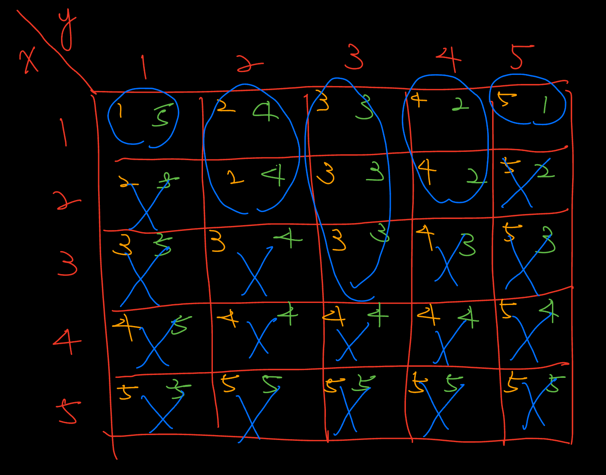

# Codeforces

## Practice Round [#1052](https://codeforces.com/contest/2146)

### A - Equal Occurrences

### B - Merging the Sets

??? note "Details"    
    
    * Thought in the contest:
        這題一開始很容易地想到如果只有一個 $S_i$ 有唯一的一個數那這個 $S_i$ 肯定是要選的，所以想到了若是把這些必須選的 $S_i$ 挑出來，那剩下的部分就看可不可以構造出答案。 -> 正向的思維

        但是這裡很快就會碰到瓶頸，花了很多時間思考如何構造出三種以上的方案，然後想到了若是有方案 A，和方案 B ，則可以使用 A + B 構造出第三種方案。
        接著是如何構造出兩種不同的方案，這裡花了很久的時間才想到，把剩下的元素剔除必選的 $S_i$，並計算剩下元素有多少可選的 $S_j$ 只要有一個元素 >= 2 則可以構造出三種以上的方案。

        花太多時間思考如何拆分成兩個以上的方案

    * Solution:

        官解為計算選擇 n - 1 和 n 個 S 的方案有多少個，這個比較像是逆向思維，一開始想到如果全選的話就可以知道可不可能構造出解答，然後想到只需要構造出方案 A, B, A + B 就好，因此若是移除一個 S 就看看是否仍然可以構造出答案，計算 n - 1 個 S 能構造出答案的有幾個。

        

### C - Wrong Binary Search

### D - Max Sum OR (Easy Version)

## Practice Round [#1053](https://codeforces.com/contest/2151) (Div.2)

### A - Incremental Subarray

### B - Incremental Path

??? note "Details"

    * Thought in the contest:
        
        這題沒有很好的想法。
    
    * Solution:

        似乎是要使用模擬範例來觀察如何得到答案。關注點應該是 i-th 和 (i - 1)-th 如何變化

### C - Incremental Stay

??? note "Details"

    * Thought in the contest:
    
        一開始也是用貪心的想法，但是沒有找到對的方向想。
    
    * Solution:

        如果要使得答案最大，那必須盡量讓 k 個人待在博物館裡，所以前 k 個時間點必須是進入，最後 k 個時間點肯定是離開。如果有抓到這個想法，可以很容易地用前綴和計算所需時間，但是對於 k 個時間點後必須是 out in out in 這種排列，每次增加一個人都會使得 in -> out , out -> in，所以可以利用這個特性 * -1，我覺得一開始可以先看每個時間點如何對答案進行貢獻，每個時間點可以貢獻 + or - 構造出最後答案。

        可以參考這個寫法學習一下怎麼寫比較漂亮 [code](https://codeforces.com/contest/2151/submission/342031350)

### D - Grid Counting

??? note "Details"

    * Thought in the contest:

        完全沒有理解題目，還需要多熟悉閱讀題目。

    * Solution:

        [參考解說](https://www.bilibili.com/video/BV1wEn4zmESD?spm_id_from=333.788.videopod.episodes&vd_source=caaccd1459c5ece44b5e2d37804871b8&p=4)

        可以先考慮把題目的圖畫出來看看

        每個欄位分別對應:
        
        $max(x, y) = k / max(x, n + 1 - y) = k$ 

        | x \\ y | 1      | 2      | 3      | 4      | 5      |
        |:------:|:------:|:------:|:------:|:------:|:------:|
        | 1      | 1 // 5 | 2 // 4 | 3 // 3 | 4 // 2 | 5 // 1 |
        | 2      | 2 // 5 | 2 // 4 | 3 // 3 | 4 // 2 | 5 // 2 |
        | 3      | 3 // 5 | 3 // 4 | 3 // 3 | 4 // 3 | 5 // 3 |
        | 4      | 4 // 5 | 4 // 4 | 4 // 4 | 4 // 4 | 5 // 4 |
        | 5      | 5 // 5 | 5 // 5 | 5 // 5 | 5 // 5 | 5 // 5 |

        可以發現:
        
        * 當 max(x, y) = 1, 時我們只有 (1, 1) 可以選擇 -> 此時 max(1, 1) = 1, max(1, 5 + 1 - 1) = 5

        * 當 max(x, n + 1 - y) = 1, 時我們只有 (1, 5) 可以選擇 -> 此時 max(1, 5) = 5, max(1, 5 + 1 - 5) = 1

        那我們可以聯想到應該是要選擇點 $(x_i, y_i)$ 使得

        * $max(x_i, y_i) = 1, 2, 3, 4, 5$
        * $max(x_i, n + 1 - y_i)$ = 1, 2, 3, 4, 5

        選 (1, 1) 時會使得剩下這些要被選

        * $max(x_i, y_i) = \textcolor{red}{1}, 2, 3, 4, 5$
        * $max(x_i, n + 1 - y_i) = 1, 2, 3, 4, \textcolor{red}{5}$

        此時 $max(x_i, n + 1 - y_i) = 5$ 會使得 所有 $max(x_i, n + 1 - y_i) = 5$ 都不能被選擇

        選 (1, 5) 時會使得剩下這些要被選

        * $max(x_i, y_i) = \textcolor{red}{1}, 2, 3, 4, \textcolor{yellow}{5}$
        * $max(x_i, n + 1 - y_i) = \textcolor{yellow}{1}, 2, 3, 4, \textcolor{red}{5}$

        此時 $max(x_i, y_i) = 5$ 會使得 所有 $max(x_i, n + 1 - y_i) = 5$ 都不能被選擇

        以此類推我們可以得到這張圖

        

        可以發現選完 k = 1, k = 5 後 只剩 (1, 2), (2, 2) 可以選，而選完這兩個其中一個後只能選 (1, 4), (2, 4) 此時會剩下

        * $max(x_i, y_i) = \textcolor{red}{1}, \textcolor{green}{2}, 3, \textcolor{green}{4}, \textcolor{yellow}{5}$
        * $max(x_i, n + 1 - y_i) = \textcolor{yellow}{1}, \textcolor{green}{2}, 3, \textcolor{green}{4}, \textcolor{red}{5}$

        所以可以知道能選的只有圖上圈起來的地方。

        可以使用組合數計算答案

        * 實作的時候有一個錯誤卡很久，原因是在讀取答案的時候，判斷不合法時直接返回使得沒有處理完全部輸入 -> 以後在處理輸入時處理東西的話要讓全部輸入都完成才行，不能中途返回
        * 要使得 1 <= k <= n 都恰好有一個的話，必須使 sum(a) == n 比這多或少都會使得 n 不合法

