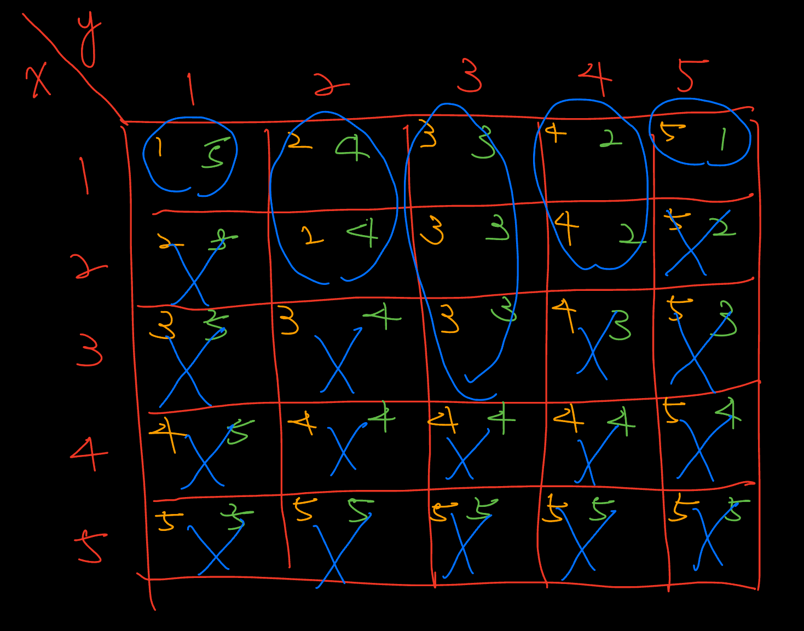

# Codeforces

### 2146B. Merging the Sets

??? note "Details"    
    
    * Thought in the contest:
        這題一開始很容易地想到如果只有一個 $S_i$ 有唯一的一個數那這個 $S_i$ 肯定是要選的，所以想到了若是把這些必須選的 $S_i$ 挑出來，那剩下的部分就看可不可以構造出答案。 -> 正向的思維

        但是這裡很快就會碰到瓶頸，花了很多時間思考如何構造出三種以上的方案，然後想到了若是有方案 A，和方案 B ，則可以使用 A + B 構造出第三種方案。
        接著是如何構造出兩種不同的方案，這裡花了很久的時間才想到，把剩下的元素剔除必選的 $S_i$，並計算剩下元素有多少可選的 $S_j$ 只要有一個元素 >= 2 則可以構造出三種以上的方案。

        花太多時間思考如何拆分成兩個以上的方案

    * Solution:

        官解為計算選擇 n - 1 和 n 個 S 的方案有多少個，這個比較像是逆向思維，一開始想到如果全選的話就可以知道可不可能構造出解答，然後想到只需要構造出方案 A, B, A + B 就好，因此若是移除一個 S 就看看是否仍然可以構造出答案，計算 n - 1 個 S 能構造出答案的有幾個。

### 2146D1. Max Sum OR (Easy Version)

### 2146D2. Max Sum OR (Hard Version)

??? note "Details"

### 2151B. Incremental Path

??? note "Details"

    * Thought in the contest:
        
        這題沒有很好的想法。
    
    * Solution:

        似乎是要使用模擬範例來觀察如何得到答案。關注點應該是 i-th 和 (i - 1)-th 如何變化

### 2151C. Incremental Stay

??? note "Details"

    * Thought in the contest:
    
        一開始也是用貪心的想法，但是沒有找到對的方向想。
    
    * Solution:

        如果要使得答案最大，那必須盡量讓 k 個人待在博物館裡，所以前 k 個時間點必須是進入，最後 k 個時間點肯定是離開。如果有抓到這個想法，可以很容易地用前綴和計算所需時間，但是對於 k 個時間點後必須是 out in out in 這種排列，每次增加一個人都會使得 in -> out , out -> in，所以可以利用這個特性 * -1，我覺得一開始可以先看每個時間點如何對答案進行貢獻，每個時間點可以貢獻 + or - 構造出最後答案。

        可以參考這個寫法學習一下怎麼寫比較漂亮 [code](https://codeforces.com/contest/2151/submission/342031350)

### 2151D. Grid Counting

??? note "Details"

    * Thought in the contest:

        完全沒有理解題目，還需要多熟悉閱讀題目。

    * Solution:

        [參考解說](https://www.bilibili.com/video/BV1wEn4zmESD?spm_id_from=333.788.videopod.episodes&vd_source=caaccd1459c5ece44b5e2d37804871b8&p=4)

        可以先考慮把題目的圖畫出來看看

        每個欄位分別對應:
        
        $max(x, y) = k / max(x, n + 1 - y) = k$ 

        | x \\ y | 1      | 2      | 3      | 4      | 5      |
        |:------:|:------:|:------:|:------:|:------:|:------:|
        | 1      | 1 // 5 | 2 // 4 | 3 // 3 | 4 // 2 | 5 // 1 |
        | 2      | 2 // 5 | 2 // 4 | 3 // 3 | 4 // 2 | 5 // 2 |
        | 3      | 3 // 5 | 3 // 4 | 3 // 3 | 4 // 3 | 5 // 3 |
        | 4      | 4 // 5 | 4 // 4 | 4 // 4 | 4 // 4 | 5 // 4 |
        | 5      | 5 // 5 | 5 // 5 | 5 // 5 | 5 // 5 | 5 // 5 |

        可以發現:
        
        * 當 max(x, y) = 1, 時我們只有 (1, 1) 可以選擇 -> 此時 max(1, 1) = 1, max(1, 5 + 1 - 1) = 5

        * 當 max(x, n + 1 - y) = 1, 時我們只有 (1, 5) 可以選擇 -> 此時 max(1, 5) = 5, max(1, 5 + 1 - 5) = 1

        那我們可以聯想到應該是要選擇點 $(x_i, y_i)$ 使得

        * $max(x_i, y_i) = 1, 2, 3, 4, 5$
        * $max(x_i, n + 1 - y_i)$ = 1, 2, 3, 4, 5

        選 (1, 1) 時會使得剩下這些要被選

        * $max(x_i, y_i) = \textcolor{red}{1}, 2, 3, 4, 5$
        * $max(x_i, n + 1 - y_i) = 1, 2, 3, 4, \textcolor{red}{5}$

        此時 $max(x_i, n + 1 - y_i) = 5$ 會使得 所有 $max(x_i, n + 1 - y_i) = 5$ 都不能被選擇

        選 (1, 5) 時會使得剩下這些要被選

        * $max(x_i, y_i) = \textcolor{red}{1}, 2, 3, 4, \textcolor{yellow}{5}$
        * $max(x_i, n + 1 - y_i) = \textcolor{yellow}{1}, 2, 3, 4, \textcolor{red}{5}$

        此時 $max(x_i, y_i) = 5$ 會使得 所有 $max(x_i, n + 1 - y_i) = 5$ 都不能被選擇

        以此類推我們可以得到這張圖

        

        可以發現選完 k = 1, k = 5 後 只剩 (1, 2), (2, 2) 可以選，而選完這兩個其中一個後只能選 (1, 4), (2, 4) 此時會剩下

        * $max(x_i, y_i) = \textcolor{red}{1}, \textcolor{green}{2}, 3, \textcolor{green}{4}, \textcolor{yellow}{5}$
        * $max(x_i, n + 1 - y_i) = \textcolor{yellow}{1}, \textcolor{green}{2}, 3, \textcolor{green}{4}, \textcolor{red}{5}$

        所以可以知道能選的只有圖上圈起來的地方。

        可以使用組合數計算答案

        * 實作的時候有一個錯誤卡很久，原因是在讀取答案的時候，判斷不合法時直接返回使得沒有處理完全部輸入 -> 以後在處理輸入時處理東西的話要讓全部輸入都完成才行，不能中途返回
        * 要使得 1 <= k <= n 都恰好有一個的話，必須使 sum(a) == n 比這多或少都會使得 n 不合法

### 2149D. A and B

??? note "Details"

    * Thought in the contest:

        這個題目是經典的中位數對齊題目，一開始我的想法是將 a / b 轉換成 0, 1 思考，並且思考只需要枚舉一半的情況，另一半可以將 a, b 交換然後再次重覆計算就可以得到另一半，一開始想的是對於枚舉所有的情況 ，左邊的 a 的個數會從 $[0, cnt_a]$ 變化，而只要能夠 $O(1)$ 或是 $O(\log{N})$ 得到 cost，就可以得到答案。

        當已知左右的 a 的個數 $left_a, right_a$ 時我們可以得到對應的目標區間 $[l, r]$，利用前綴和分別可以知道 $[0, l), (r, 0]$ 的 b 的下標貢獻。此時對於 $[l, r]$ 中的 a 下標貢獻要分成兩部分，分給左半邊跟分給右半邊，這裡我使用二分 lower_bound 找到 $\le l$ 的第一個 a 開始的下標，使用前綴和計算分給左右兩邊的貢獻。
        
        * 理論上這個方法可以使用指針的方式得到 $\le l$ 的第一個 a 開始的下標，但是當時思考太混雜決定用 lower_bound 簡化處理。

        * 一開始其實有想到要使用下標 $a_i - t_i$ 方式出發，但是想到計算會有負數時卡住了，沒有繼續往下走，應該可以繼續的但是思考方式不太對，加上絕對值有機會可以往下走

        [code](https://codeforces.com/contest/2149/submission/342666432)

    * Solution:

        1. [官方解答](https://codeforces.com/blog/entry/146793)為目標 subarray 開始的第一個下標為 $t_0$，所以答案為 $\sum{|a_i - (t_0 + i)|}$，移項後可以得到 $\sum{|(a_i - i) - t_0|} = \sum{|F_i - t_0|} \text{, for } F_i = a_i - i$，可以看成在一堆新座標 $F_i$ 中 我們要減去一個座標得到最小值 $min(\sum{|F_i - t_0|})$，這是經典的中位數貪心(或是這種題目可以叫[中位數對齊](https://slipet.github.io/5lipet/greedy/greedy/#median-alignment))

            * [code](https://codeforces.com/contest/2149/submission/342669253)

        2. 另一種更為直觀的貪心想法，基本上最小的開銷為將所有的 a 或 b 往中間聚在一起，所以最小的開銷為中為數貪心的方式計算貢獻 $\sum{|a_i - a_{mid}|}$，這裡有個小陷阱，往中間靠的時候每個元素都要佔據一個位置，所以要分別減去對應的位置。
        
            $\sum{|a_i - a_{mid}|} - \frac{left_a \times (left_a + 1)}{2} - \frac{right_a \times (right_a + 1)}{2}$

            * [video](https://www.bilibili.com/video/BV1y6n8zFEKW/?spm_id_from=333.337.search-card.all.click&vd_source=caaccd1459c5ece44b5e2d37804871b8)

            * [code](https://codeforces.com/contest/2149/submission/342785403)

        3. 第三種想法是看到 [jiazhichen844](https://codeforces.com/contest/2149/submission/340391056), [exgcd](https://codeforces.com/contest/2149/submission/340386200), [Misuki](https://codeforces.com/contest/2149/submission/340393665)，這些人的寫法感到好奇，但是在網路上搜索很久之後幾乎找不到這種做法的講解，頂多是又找到了其他前綴和計算貢獻的方式而不是這種一次計算最後取 min 得方式，因此嘗試使用 [CHAT-GPT](https://chatgpt.com/s/t_68e7df5b40308191a5f42d6aa9d39982) 解釋看看。
        
            基本得想法是每個位置 i 有往左或往右兩種選擇，假設我們想構造出連續 a 的 subarray，那在每個位置的 b 都必須往左或往右移動，往兩側移動的開銷可以看作要跨越多少的 a，取最小的開銷 $min(left_a, right_a)$，可以得到在 b 位置上的 cost，最後累加所有 b 的 cost 可以得到 構造出連續 a 的 subarray 的 cost。

            一個會卡住的點是 以 ababab 為例子，第一個 b 的 $cost = min(1, 2) = 1$，往左的開銷很直觀為 1，往右的開銷卻是 2，看起來很像錯的因為看起來走兩步還是無法跨過 a 到達右側 ex. a[ ]ab[b]ab，但是考慮到下一個 b 可以發現 aba[b]ab 若是先往右走可以到達右側使得 a 可以聚集在一起 abaa[b]b，這時
            第一個 b 只要走兩步就可以到達。

            這個方法可以看成上面方法的反向思考，思考不合法的元素該如何移動造成的開銷。

            比較直觀的想法應該是 gpt 的這個想法:

            相鄰交換要讓 a（或 b）成段，等價於讓每個 b（或 a）往某一側移到區塊外，並跨過必要的 a（或 b）次數。

            * [code](https://codeforces.com/contest/2149/submission/342669253)

            延伸思考:
                或許可以加上逆序對幫助思考? 或是利用逆序對變成延伸題目?

                结论:
                交换相邻两项的数组使其有序，所要的操作次数就是逆序对数

### 2147C. Rabbits

??? note "Details"

    一開始有觀察到若是連續的 1/0 只需要考慮最邊緣的 1/0 是如何連接的，第一次嘗試的時候利用前綴和計算是否存在像 11011 這種 pattern 的子字串，但是沒考慮到像是 1010101 這種有奇數個 0 的例子。觀察到若是 010 是合法的，但是 0110 是非法的，所以若是兩個 11 組合成的子字串 11[01010 ... 01010]11 ，考慮這個被圍住的子字串，若是0的個數為奇數則無法組成合法解，接著考量其中一端接著的是 00 這種 pattern，會發現我們可以依照被圍住的子字串奇偶性質決定是否要將 0 分配給子字串構成合法解。

    * 一開始想用狀態機的方式但是能力不夠。 
    
    * 分類討論的能力不構 

    * 中間有想用dp的方式解，但是定義區間的能力不足 